# Scrapal Architecture Reference

**Document type:** Complete component architecture and workflow reference
**Repository snapshot:** branch `v3`, commit `75ef7a8` (includes the extraction-guard fix in `1144e7b`)
**Verified against:** the running local stack and the live PostgreSQL schema on 5 September 2026
**Companion document:** [`SCRAPAL_MASTER.md`](SCRAPAL_MASTER.md) covers product position, roadmap and honesty gates. This document covers *only* what the software is made of and how each piece behaves.

Every diagram below is also a standalone Mermaid source in [`diagrams/architecture/`](diagrams/architecture/), and every count in the census was derived by querying the code and the live database rather than by reading prose. The derivation commands are listed in [§12](#12-how-every-number-here-was-derived).

---

## 1. How to read this document

Scrapal is one system that can be sliced eight different ways. A "component" therefore needs a definition, or the count is meaningless.

**A component is a named unit that owns a distinct responsibility and can be reasoned about, tested, or replaced on its own.** Layers are *views of the same system*, not disjoint piles of hardware: the three Celery tasks in Layer 8 execute inside the `worker` runtime service in Layer 1, and the eleven domain services in Layer 4 run inside both `api` and `worker`. Counting them separately is deliberate — they fail, scale and change independently — but the layers overlap by design, so **do not add the layer totals expecting physical machines.**

---

## 2. Component census

**60 software components across 8 layers, backed by 26 database tables and 9 state enums.**

| # | Layer | Components | What lives here |
|---|---|---|---|
| 1 | Runtime services | **14** | Docker Compose services: 7 core, 7 observability-profile |
| 2 | API routers | **6** | 62 HTTP endpoints, plus `/health` and the `/metrics` mount |
| 3 | Platform core | **9** | Config, DB, ORM, schemas, security, Celery app, telemetry, extension registry, app factory |
| 4 | Domain services | **11** | Ingestion, indexing, chunking, search, generation, blueprints, events, evaluation, Ollama, institutions, artifacts |
| 5 | Connectors and extractors | **6** | 3 connectors, 1 registry, 2 course extractors |
| 6 | Persistence | **26 tables** | + 9 enums, pgvector HNSW and GIN indexes |
| 7 | Console | **11 modules** | 9 operator views in a single React application |
| 8 | Async tasks | **3** | `scrapal.ingest`, `scrapal.generate`, `scrapal.reindex` |

One external dependency sits outside all eight layers: **host Ollama**, reached at `host.docker.internal:11434`, serving three models (`qwen2.5:7b-instruct` for chat, `llama3.2:3b` fast, `nomic-embed-text` for 768-dimension embeddings).

### 2.1 System context

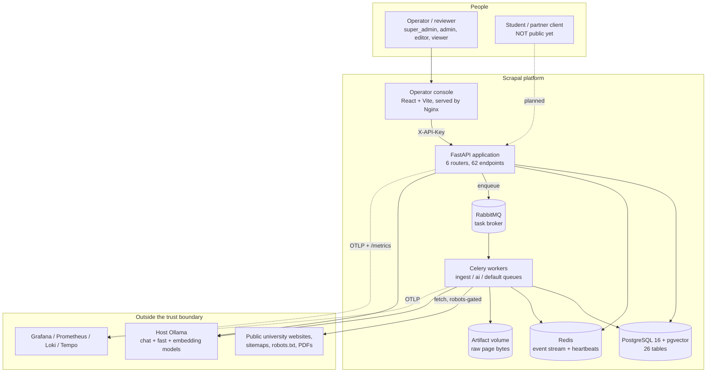

### 2.2 The full component map

```mermaid
flowchart TB
    subgraph L7["Layer 7 — Console (11 modules, 9 views)"]
        direction LR
        V1["App.tsx<br/>shell + 7 views"]
        V2["CourseGallery.tsx<br/>gallery, dossier, compare"]
        V3["api.ts<br/>typed HTTP client"]
        V4["CollectionScope · GalleryState<br/>RunPath · QueryPlan · ui · lib"]
    end

    subgraph L2["Layer 2 — API routers (6 modules, 62 endpoints)"]
        direction LR
        R1["api.py · /v1<br/>25 endpoints"]
        R2["blueprints_api.py<br/>5"]
        R3["course_intelligence_api.py<br/>8"]
        R4["course_gallery_api.py<br/>8"]
        R5["retrieval_api.py<br/>6"]
        R6["observability_api.py<br/>10"]
    end

    subgraph L3["Layer 3 — Platform core (9 modules)"]
        direction LR
        P1["security.py<br/>API key, Principal, RBAC"]
        P2["config.py · db.py"]
        P3["models.py · schemas.py"]
        P4["jobs.py<br/>Celery app + 3 tasks"]
        P5["telemetry.py · extensions.py · main.py"]
    end

    subgraph L4["Layer 4 — Domain services (11 modules)"]
        direction LR
        S1["ingestion"]
        S2["blueprints"]
        S3["indexing · chunking"]
        S4["search · generation"]
        S5["ollama"]
        S6["institutions · artifacts"]
        S7["crawl_events · evaluation"]
    end

    subgraph L5["Layer 5 — Connectors and extraction (6 units)"]
        direction LR
        C1["WebsiteConnector"]
        C2["DocumentConnector"]
        C3["GreenwichConnector"]
        E1["registry.resolve_extractor"]
        E2["GenericUniversityExtractor"]
        E3["GreenwichCourseExtractor"]
    end

    subgraph L6["Layer 6 — Persistence (26 tables, 9 enums)"]
        direction LR
        D1[("Tenancy + catalogue")]
        D2[("Crawl + telemetry")]
        D3[("Documents + chunks + vectors")]
        D4[("Records + revisions")]
        D5[("Conversations + retrieval")]
    end

    subgraph L1["Layer 1 — Runtime (14 services + host Ollama)"]
        direction LR
        N1["api"]
        N2["worker"]
        N3["scheduler"]
        N4["console"]
        N5["postgres · redis · rabbitmq"]
        N6["7 observability-profile services"]
    end

    L7 -->|"HTTPS + X-API-Key"| L2
    L2 --> L3
    L2 --> L4
    L3 --> L4
    L4 --> L5
    L4 --> L6
    L5 --> L6
    L3 -.->|"hosted by"| L1
    L4 -.->|"hosted by"| L1
```

---

## 3. Layer 1 — Runtime services (14)

Defined in [`docker-compose.yml`](../docker-compose.yml). Seven services always run; seven more are gated behind the `observability` Compose profile so a laptop can run the product without the telemetry stack.

### 3.1 Core profile (7)

| Service | Image / command | Responsibility | Notes |
|---|---|---|---|
| `postgres` | `pgvector/pgvector:pg16` | System of record and vector store | Health-gated; every other backend service waits on it |
| `rabbitmq` | `rabbitmq:4-management-alpine` | Celery broker | Management UI on `:15672`; Prometheus plugin enabled |
| `redis` | `redis:7-alpine` | Live event stream and worker heartbeats | `--save 60 1`; loss is tolerated, never fatal |
| `api` | `alembic upgrade head && uvicorn` | HTTP surface on `:8000` | **Migrations run in the API container's start command**, so the schema is current before the first request |
| `worker` | `celery worker --queues=ingest,ai,default --concurrency=2` | All long-running work | `--without-gossip --without-mingle` for quiet startup |
| `scheduler` | `celery beat` | Recurring schedules | Present and running; **no recurring crawl schedule is configured yet** |
| `console` | Nginx + built React bundle | Operator UI on `:3000` | Proxies `/api` to the API container; waits for API health |

### 3.2 Observability profile (7)

`otel-collector` (OTLP `:4317`/`:4318`) fans traces into `tempo` and logs into `loki`. `prometheus` scrapes `/metrics` and feeds `alertmanager`. `grafana` (`:3001`) reads all three. `flower` (`:5555`) inspects the Celery broker directly.

### 3.3 Runtime topology

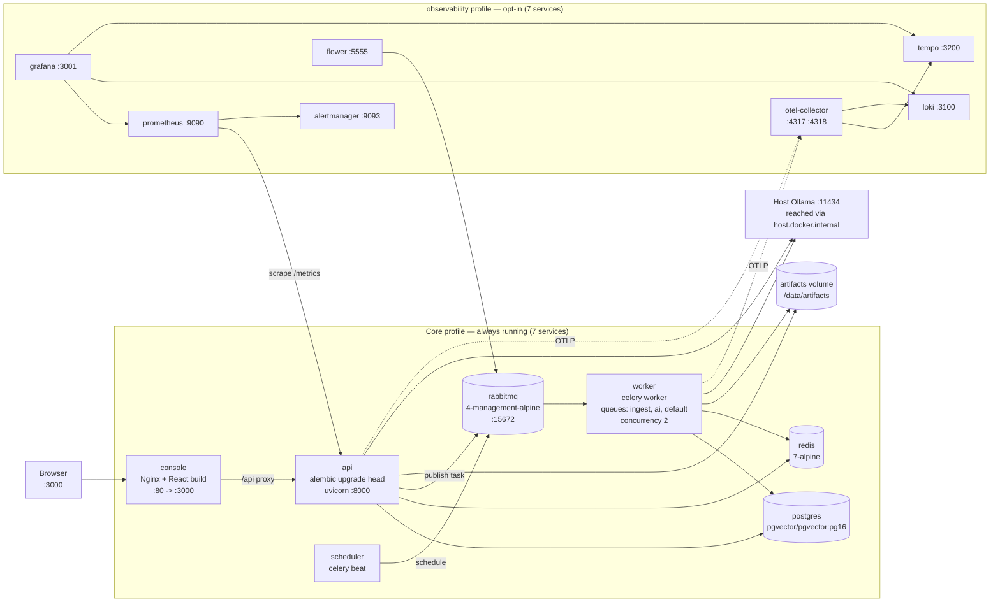

**Volumes (6):** `artifacts` holds raw fetched bytes and is mounted into every backend container; `postgres_data`, `prometheus_data`, `loki_data`, `tempo_data` and `grafana_data` persist their respective stores.

---

## 4. Layer 2 — API routers (6 modules, 62 endpoints)

All six are mounted in [`main.py`](../src/scrapal/main.py). Every endpoint resolves a `Principal` before touching data.

| Router | Prefix | Endpoints | Minimum role | Owns |
|---|---|---|---|---|
| [`api.py`](../src/scrapal/api.py) | `/v1` | 25 | mixed | Collections, sources, runs, documents, uploads, search, records, conversations, action proposals |
| [`blueprints_api.py`](../src/scrapal/blueprints_api.py) | `/v1/crawl-blueprints` | 5 | editor | Preview, patch, approve, run |
| [`course_intelligence_api.py`](../src/scrapal/course_intelligence_api.py) | `/v1/admin/course-intelligence` | 8 | super_admin | Coverage overview, record review, publish gate, revisions |
| [`course_gallery_api.py`](../src/scrapal/course_gallery_api.py) | `/v1/admin/course-gallery` | 8 | super_admin | Published-course discovery, facets, dossiers, shortlist |
| [`retrieval_api.py`](../src/scrapal/retrieval_api.py) | `/v1/admin/retrieval-lab` | 6 | super_admin | Retrieval traces, embedding profiles, evaluations |
| [`observability_api.py`](../src/scrapal/observability_api.py) | `/v1/admin/observability` | 10 | super_admin | Fleet overview, run timelines, events, incidents, workers, dependencies |

Two surfaces sit outside the routers: `GET /health` and the Prometheus ASGI app mounted at `/metrics`.

### 4.1 Request authentication and tenancy

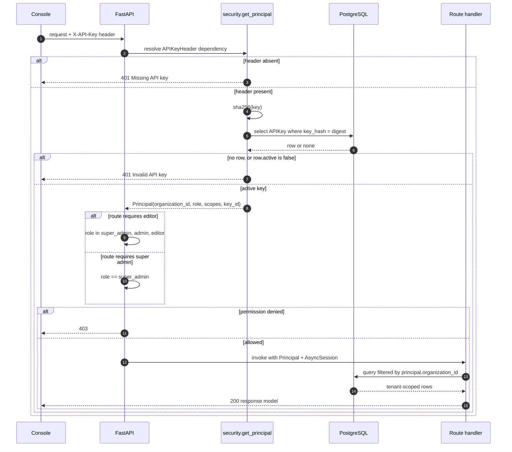

---

## 5. Layer 3 — Platform core (9 modules)

| Module | Responsibility | Workflow worth knowing |
|---|---|---|
| [`main.py`](../src/scrapal/main.py) | App factory and lifespan | On startup: create the artifact dir, `init_db()`, `bootstrap_identity()`, `ensure_default_profile()`, then seed a first collection if none exists |
| [`config.py`](../src/scrapal/config.py) | `Settings` via pydantic-settings | `SCRAPAL_` env prefix, `@lru_cache` singleton. Caps live here: `max_pages_per_run=500`, `request_timeout_seconds=25`, `max_upload_bytes=25MB`, `embedding_dimensions=768` |
| [`db.py`](../src/scrapal/db.py) | Async engine and session factory | `init_db()` creates the `vector` extension, then **three indexes**: HNSW cosine on `chunks.embedding`, GIN on `to_tsvector('english', chunks.content)`, HNSW on `chunk_embeddings.embedding` |
| [`models.py`](../src/scrapal/models.py) | 26 ORM tables, 9 enums | Every id is a 36-char UUID string; `metadata_json` avoids SQLAlchemy's reserved `metadata` |
| [`schemas.py`](../src/scrapal/schemas.py) | Pydantic request/response models | The API never returns an ORM object unshaped |
| [`security.py`](../src/scrapal/security.py) | Identity and RBAC | SHA-256 key hashing, `Principal` dataclass, three dependency gates, `bootstrap_identity` seeds the first org and super-admin key |
| [`jobs.py`](../src/scrapal/jobs.py) | Celery app and 3 tasks | Queue routing, late acks, and the `engine.dispose()` event-loop isolation described in §11.3 |
| [`telemetry.py`](../src/scrapal/telemetry.py) | Metrics, tracing, structured logs | 12 Prometheus instruments; `SECRET_KEY` regex redacts `authorization`, `cookie`, `secret`, `token`, `password`, `api_key` from every log |
| [`extensions.py`](../src/scrapal/extensions.py) | Plugin contract | `Connector` ABC + `ExtensionManifest`; `extension_catalog()` scans six entry-point groups |

### 5.1 The tenancy and egress boundary

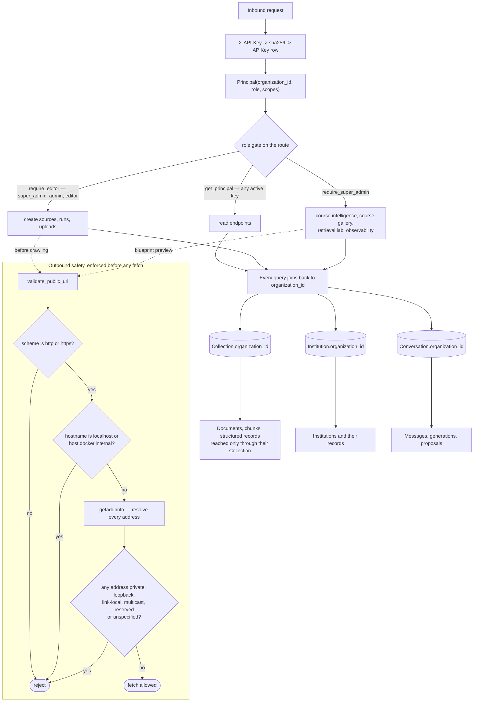

---

## 6. Layer 4 — Domain services (11)

### 6.1 `ingestion` — the crawl engine

The largest single component (719 lines). Entry point `ingest_run(run_id)`; per-source work in `_ingest_source`.

**Workflow.** Load run and source → pick connector by `source.kind` → build the frontier (three ways: replay a previous run's failed URLs, expand a sitemap, or seed a single start URL) → loop pages until the frontier drains or `min(max_pages, 500)` is reached.

Per page: heartbeat → re-read `cancel_requested` → robots check → `safe_fetch` (3 attempts, backoff on 429 and 5xx) → connector extract → course extraction inside the LLM budget → persist → enqueue in-scope links if depth allows.

**Failure design, and it is the interesting part:**
- Each page's persistence runs inside `session.begin_nested()`. A `SAVEPOINT` means one unreadable page rolls back alone; the 500-page run continues.
- `mark_run_terminal` retries **6 times with exponential backoff** in its own session, because the run's own transaction may already be poisoned by the exception that ended it.
- Cancellation is cooperative and checked once per page, never mid-fetch.
- A failed run raises an `Incident` with fingerprint `run-failed:{run_id}`.

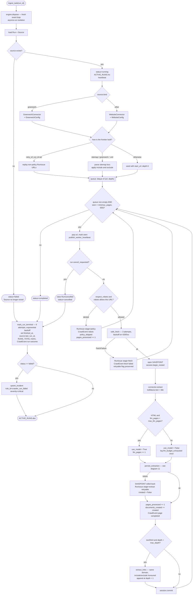

The same loop as a state machine, per page:

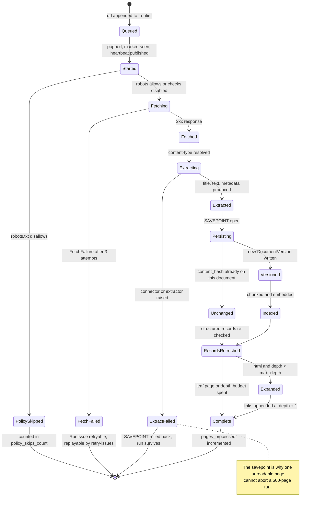

And the run's own status transitions:

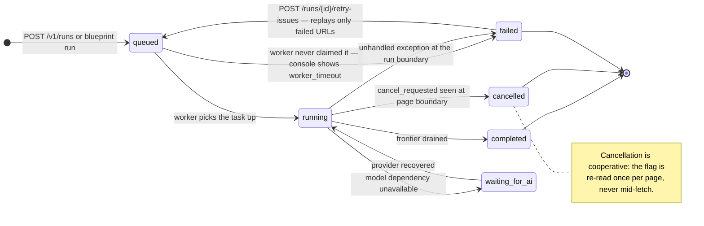

### 6.2 `blueprints` — plan before you crawl

Samples a site *before* any bulk fetch, so an operator approves a scope with evidence rather than optimism.

`preview_blueprint` validates the URL against the SSRF guard, fetches `robots.txt` and the start page concurrently, gathers candidates (sitemap `<loc>` entries if advertised, otherwise in-scope page links, capped at 5000), classifies each by `classify_page_type`, picks up to **16 representative URLs**, samples them, and runs `detect_evidence_fields` to produce a **per-field coverage projection**. Confidence is reported as `medium` only when at least 6 pages formed the basis.

The output is a `CrawlBlueprint` in `draft`. Patching it bumps `version`. Approval creates the `Source` — and calls `resolve_institution`, which is the only place an `Institution` row is born.

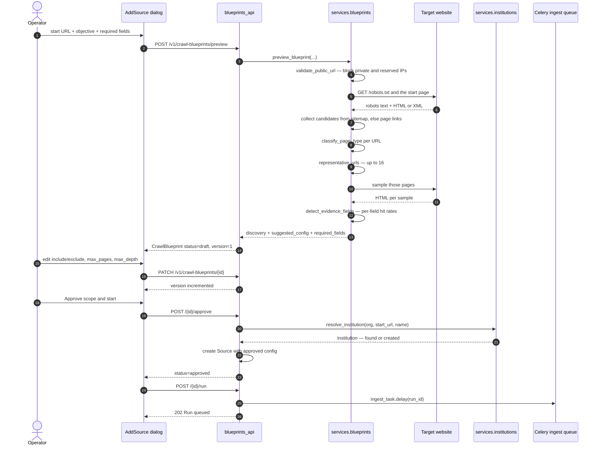

### 6.3 `institutions` — one door for a new university

`resolve_institution(session, organization_id, url, name)` derives the registrable domain, returns the existing institution or creates one with a uniqueness-retried slug, and infers `country_code` from the domain suffix. Returns `None` for an unreadable domain rather than inventing an institution. Both source-creation routes call it, which is why adding a fourth university needs no code.

### 6.4 `artifacts` — raw bytes, content-addressed

`store_artifact(content, suffix)` returns `(sha256_digest, path)`. The digest is the deduplication key for `DocumentVersion`; the file is the auditable original behind every extracted claim.

### 6.5 `chunking` — structure-aware splitting

`chunk_text(text, target_tokens=600, overlap_tokens=80)` produces `TextChunk`s carrying `position`, `heading`, `section_path`, a `stable_anchor` slug, and `content_hash`. Version-stamped `CHUNKER_VERSION = "structure-v1"`, so changing the algorithm invalidates indexes deliberately.

### 6.6 `indexing` — chunks, vectors, and index state

`index_document_version` is idempotent: if a `DocumentIndex` is already `ready` with the same `content_hash` *and* `chunker_version`, it returns immediately. Otherwise it deletes stale chunks, re-chunks, embeds, and writes `ChunkEmbedding` rows.

Three distinct failure outcomes rather than one:
- **`waiting`** — Ollama unreachable. Chunks are kept, embeddings are zero, the work is resumable.
- **`failed`** — wrong vector count or wrong dimensions. Also flips `profile.healthy = False` so retrieval stops trusting that profile.
- **`ready`** — sets `document.current_version_id` and marks every older ready index `stale`.

### 6.7 `ollama` — the local model gateway

Wraps chat, `structured` (JSON-schema-constrained), and `embed`. Exposes a `workload()` async lock so a generation holds the model rather than interleaving with a competing request, and `unload_chat=True` lets an embedding call evict the chat model on a memory-constrained machine. Raises `OllamaUnavailable`, which every caller treats as *degrade*, never *crash*.

### 6.8 `search` — three-lane hybrid retrieval

Covered in full in §9.1.

### 6.9 `generation` — grounded answers or silence

Covered in full in §9.2.

### 6.10 `crawl_events` — the observability spine

Covered in §10.

### 6.11 `evaluation` — retrieval quality runs

`run_evaluation(evaluation_id)` replays a question set against a chosen embedding profile and records scores on `EvaluationRun`, so an embedding change is a measured decision rather than a vibe.

---

## 7. Layer 5 — Connectors and extractors (6)

### 7.1 Connectors (3)

| Connector | Handles | Extract behaviour |
|---|---|---|
| `WebsiteConnector` | HTML and PDF over HTTP(S) | `trafilatura` for main text with links and tables preserved, BeautifulSoup fallback |
| `DocumentConnector` | Uploaded PDF, DOCX, HTML, Markdown, text | PDF keeps **per-page** text so citations can name a page number |
| `GreenwichConnector` | `gre.ac.uk` | Subclasses `WebsiteConnector` with a site-specific config |

`WebsiteConnector` also owns the crawl-safety primitives: `validate_public_url` (the SSRF guard), `robots_allowed`, `allowed_link` and `extract_links`.

### 7.2 Extraction registry and extractors (3)

Extractor choice is **decoupled from connector choice** — a deliberate fix, because extraction was once selected by the literal hostname `gre.ac.uk`, which is precisely why every other university crawled cleanly and produced nothing.

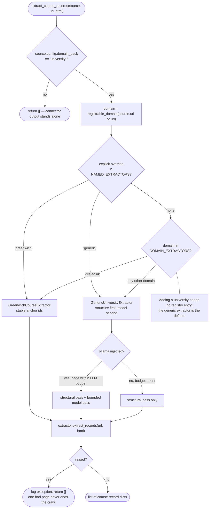

### 7.3 The generic extraction pipeline

Deterministic structure first; a bounded model pass second; every model-supplied value verified against the page before it is kept.

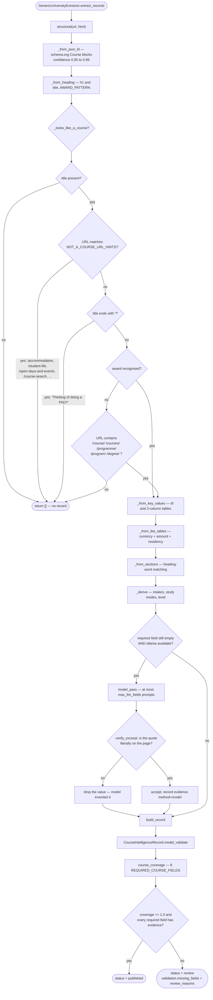

**The `_looks_like_a_course` gate deserves its own note.** A campus page, an accommodation page and a course page all have an `<h1>`. Without a course signal the extractor mints a "course" from any heading. The gate now requires, in order: a title; no match against `NOT_A_COURSE_URL_HINTS`; a title that is not a question; then either a recognised award or a URL containing a course-naming path segment (`/course/`, `/courses/`, `/programme/`, `/program/`, `/degree/`).

Section prefixes were removed from the positive hints because they are not course signals — a university that files accommodation, open days and student profiles under `/study/` will otherwise produce a catalogue of halls of residence.

**Evidence is the output, not a side effect.** Every field carries `source_url`, `method` (`jsonld`, `keyvalue`, `heading`, `model`, …), `excerpt`, optional `section`, and `confidence`. A model-supplied value whose quote is not literally on the page is discarded by `verify_excerpt`.

Coverage is computed over 8 `REQUIRED_COURSE_FIELDS`: `title`, `award`, `level`, `campuses`, `durations`, `intake_months`, `fees`, `entry_requirements`.

---

## 8. Layer 6 — Persistence (26 tables, 9 enums)

### 8.1 Table groups

| Group | Tables |
|---|---|
| Tenancy | `organizations`, `api_keys` |
| Catalogue | `collections`, `institutions`, `sources`, `crawl_blueprints` |
| Crawl execution | `runs`, `run_issues` |
| Telemetry | `crawl_events`, `incidents` |
| Content | `documents`, `document_versions` |
| Retrieval index | `chunks`, `chunk_embeddings`, `embedding_profiles`, `document_indexes` |
| Structured knowledge | `structured_records`, `structured_record_revisions`, `course_shortlist_entries` |
| Conversation and RAG | `conversations`, `messages`, `message_generations`, `generation_events`, `retrieval_runs`, `evaluation_runs` |
| Governance | `action_proposals` |

The live database also carries `alembic_version`, which is migration bookkeeping rather than an application table.

### 8.2 Enums (9)

`Role`, `SourceKind`, `RunStatus`, `ProposalStatus`, `IndexStatus`, `GenerationStatus`, `EvaluationStatus`, `RecordStatus`, `BlueprintStatus`.

### 8.3 Entity relationships

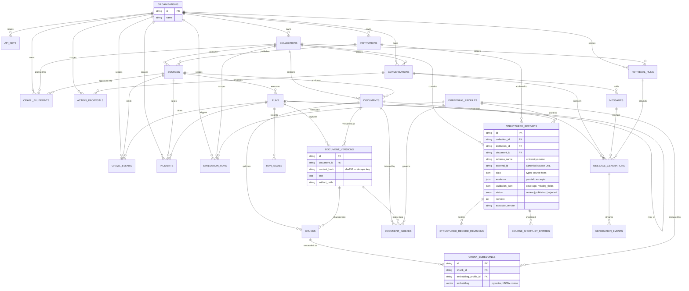

### 8.4 Invariants the schema enforces

1. **Tenant reachability.** Every content row reaches an `organization_id` through `Collection`, `Institution` or `Conversation`. There is no unscoped read path.
2. **Content addressing.** `(document_id, content_hash)` decides whether a fetch is a new version or a no-op. An unchanged page costs no re-embedding.
3. **One current version.** `documents.current_version_id` names the indexed version; retrieval joins `Document.current_version_id == Chunk.document_version_id`, so superseded chunks are invisible to search without being deleted.
4. **Revision, never overwrite.** Any change to a `structured_record` writes a `structured_record_revisions` snapshot and increments `revision`.
5. **Cascade only where history is worthless.** `structured_record_revisions` and `course_shortlist_entries` cascade from their record; documents and versions do not cascade from collections, so deleting a collection is a deliberate, ordered operation.
6. **Institution freshness.** A revisited record refreshes `institution_id` even when nothing else changed — otherwise a page that never changes again keeps a stale institution and silently drops out of institution joins.

### 8.5 Versioning and indexing workflow

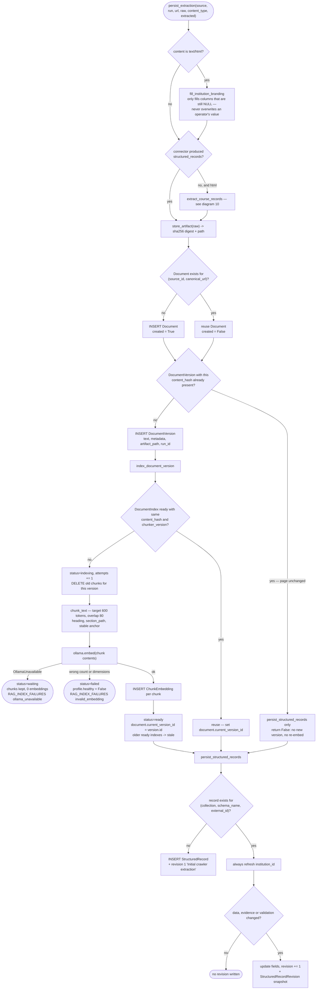

---

## 9. Cross-cutting workflow: retrieval and generation

### 9.1 Three-lane hybrid retrieval

`retrieve_knowledge` runs a structured lane, a lexical lane and a semantic lane, then fuses them.

Two details that look like noise and are not:
- `session.rollback()` **before** query planning and `session.commit()` **before** embedding. Both release the PostgreSQL connection across a call to Ollama that can take minutes on a constrained machine. Without them the database sits idle-in-transaction for the duration.
- Caller-supplied filters are **re-validated** through the same slot vocabulary as the model's plan. Caller input is free text too.

Fusion is reciprocal rank fusion weighted **structured 1.35, lexical 1.0, vector 1.0** — structured records outrank prose because they already passed the publish gate. A per-document cap of 3 chunks stops one verbose page from filling the context window; every drop is recorded as an exclusion, so the Retrieval Lab can show *why* a passage is missing.

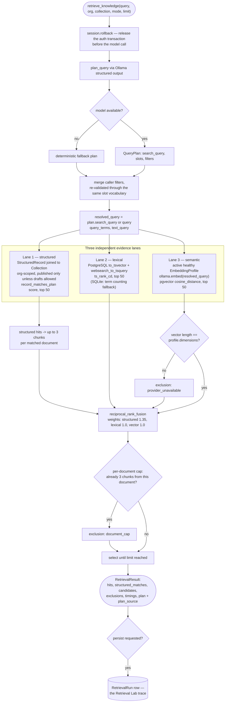

### 9.2 Generation with sentence-level validation

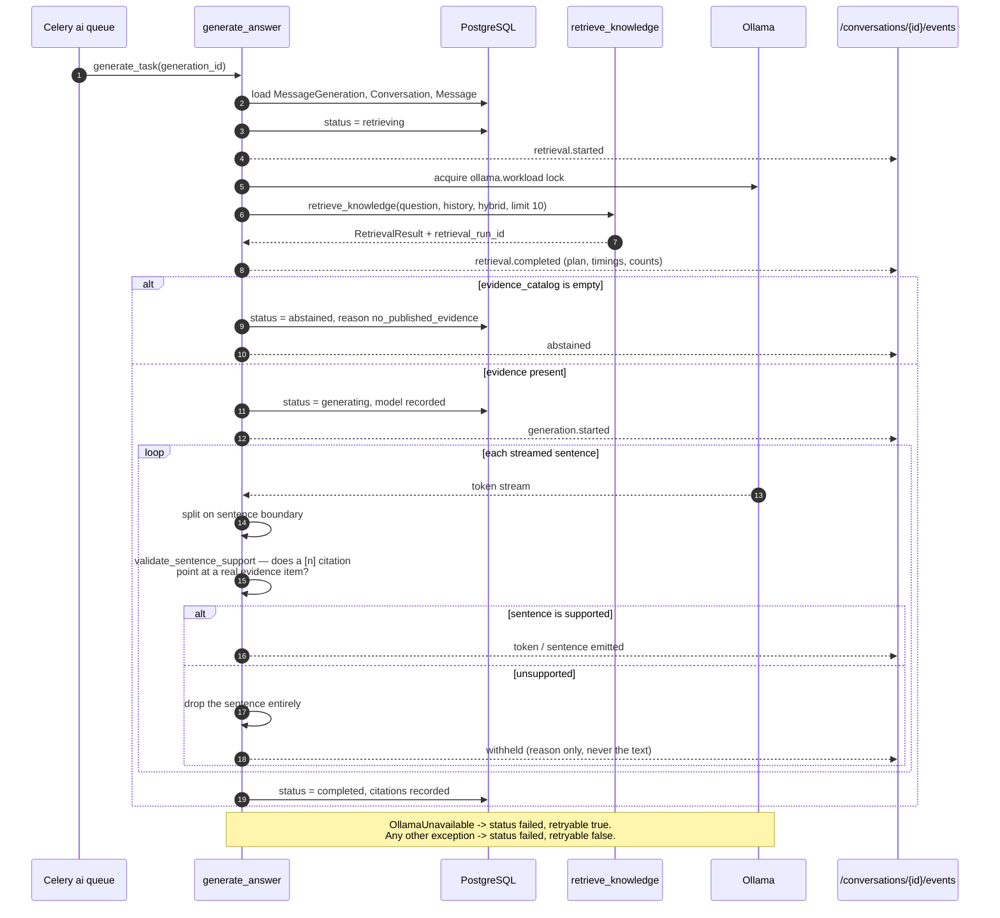

The rule that shapes this component: **a sentence that cannot cite real evidence never reaches the user.** Validation happens per sentence during streaming, and a withheld sentence is reported by reason only — the text stays out of the payload because it may contain the invented fee that failed validation in the first place. With no evidence at all the generation abstains rather than answering.

### 9.3 Review and publication

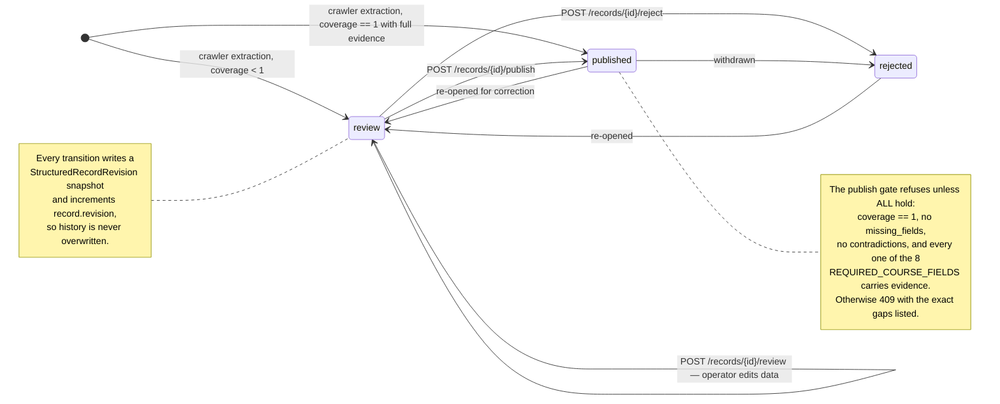

The publish gate refuses with `409` unless coverage is exactly `1`, `missing_fields` is empty, `contradictions` is empty, **and** all 8 required fields carry evidence. The response names the specific gaps. Publishing also triggers `reindex_task`, because a published record changes what retrieval should see.

### 9.4 Course gallery

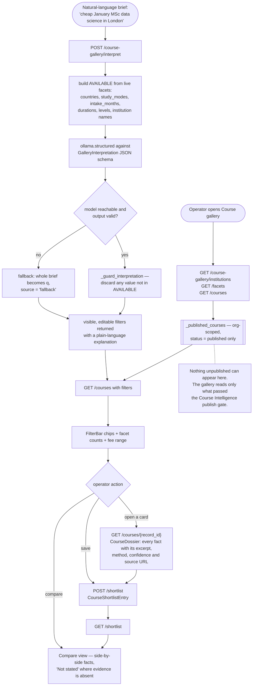

The natural-language brief is interpreted into **visible, editable filters** rather than a hidden query. `_guard_interpretation` discards any value the model produced that is not in the live facet vocabulary, and an unreachable model degrades to keyword search with `source: "fallback"` stated in the response.

---

## 10. Layer 7 — Observability pipeline

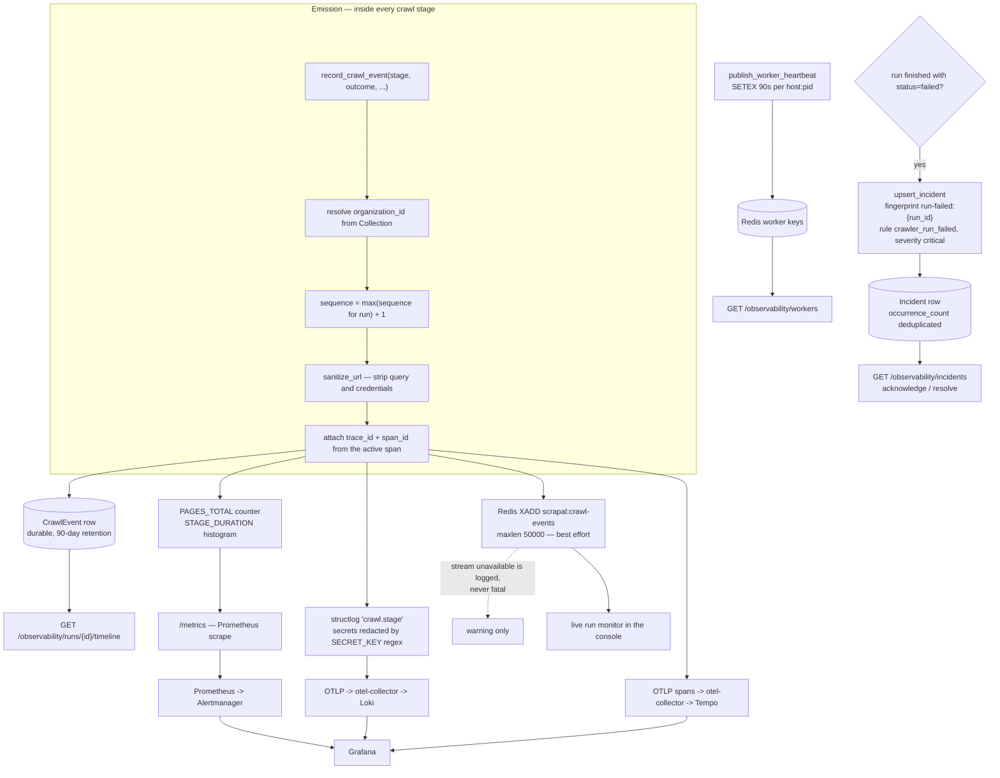

Every crawl stage calls `record_crawl_event`, which emits **four ways at once**: a durable `CrawlEvent` row, Prometheus counters and histograms, a redacted structured log line, and a best-effort Redis stream push for the live console. The Redis push is wrapped so a stream outage is a warning, never a failed crawl.

`sanitize_url` strips query strings and credentials before any URL is persisted or logged. Trace and span ids are attached to each event, so a row in the console links to its Tempo trace.

**Prometheus instruments (12):** `RUNS_TOTAL`, `ACTIVE_RUNS`, `PAGES_TOTAL`, `STAGE_DURATION`, `FETCH_BYTES`, `OUTPUT_TOTAL`, `RAG_STAGE_DURATION`, `RAG_CANDIDATES`, `RAG_QUERIES`, `RAG_CITATIONS`, `RAG_CONTEXT_SIZE`, `RAG_INDEX_FAILURES`.

---

## 11. Layer 8 — Async tasks (3) and the console (11 modules)

### 11.1 Queue topology

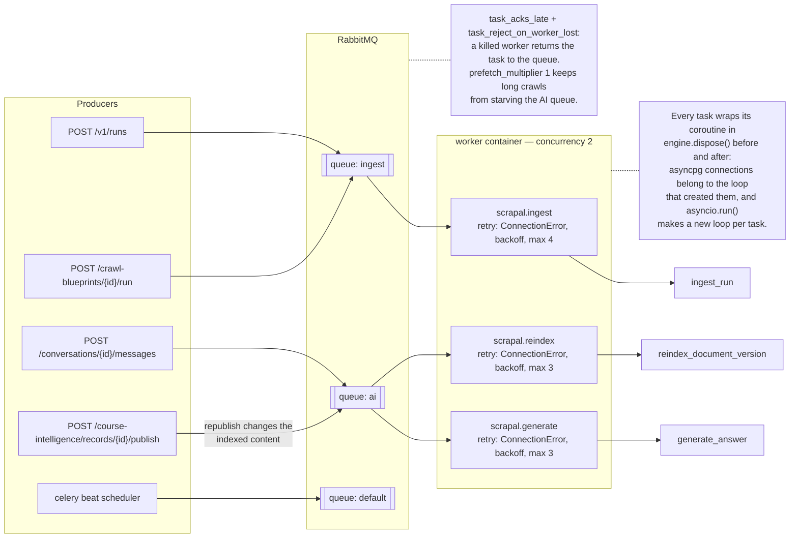

### 11.2 Task table

| Task | Queue | Retries | Entry point |
|---|---|---|---|
| `scrapal.ingest` | `ingest` | `ConnectionError`, backoff, max 4 | `ingest_run` |
| `scrapal.generate` | `ai` | `ConnectionError`, backoff, max 3 | `generate_answer` |
| `scrapal.reindex` | `ai` | `ConnectionError`, backoff, max 3 | `reindex_document_version` |

### 11.3 The event-loop isolation every task shares

Celery runs many tasks in one long-lived forked process, while `asyncio.run()` creates a **fresh event loop per task**. AsyncPG connections belong to the loop that created them. Each task therefore calls `await engine.dispose()` both before and after its coroutine, so a pooled connection can never leak into the next task's loop. Skipping this produces intermittent, near-undebuggable cross-task failures.

### 11.4 Console

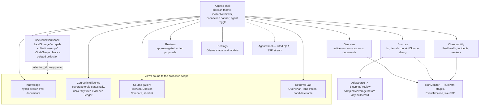

Nine views in one React application. State is TanStack Query over a typed `api.ts` client; the collection scope persists in `localStorage`, and `isStaleScope` clears a scope whose collection no longer exists — necessary because `CollectionPicker` hides itself below two collections, so a stale id would otherwise filter every view to nothing with no control left to clear it.

---

## 12. How every number here was derived

Counts in this document are query results, not estimates. Re-run these to re-verify:

```bash
grep -c '__tablename__' src/scrapal/models.py                       # 26 tables
grep -c '^class .*enum.Enum' src/scrapal/models.py                  # 9 enums
grep -l 'APIRouter(' src/scrapal/*.py | wc -l                       # 6 routers
grep -h '^@router\.' src/scrapal/*.py | wc -l                       # 62 endpoints
ls src/scrapal/services/*.py | grep -v __init__ | wc -l             # 11 services
grep -c '@celery_app.task' src/scrapal/jobs.py                      # 3 tasks

docker compose exec -T postgres psql -U scrapal -d scrapal -c \
  "select count(*) from information_schema.tables where table_schema='public'"   # 27 = 26 + alembic_version
```

Diagram sources are validated, not eyeballed — all 20 parse under Mermaid 11:

```bash
npm i --no-save mermaid jsdom                              # parser needs a DOM
node scripts/validate-diagrams.mjs docs/diagrams/architecture   # 20 standalone sources
node scripts/validate-diagrams.mjs docs/ARCHITECTURE.md         # 20 embedded blocks
```

---

## 13. Diagram index

| # | Diagram | Type | Source |
|---|---|---|---|
| 1 | System context | flowchart | [`01-system-context.mmd`](diagrams/architecture/01-system-context.mmd) |
| 2 | Component map | flowchart | [`02-component-map.mmd`](diagrams/architecture/02-component-map.mmd) |
| 3 | Runtime topology | flowchart | [`03-runtime-topology.mmd`](diagrams/architecture/03-runtime-topology.mmd) |
| 4 | Request auth and tenancy | sequence | [`04-request-auth-flow.mmd`](diagrams/architecture/04-request-auth-flow.mmd) |
| 5 | Blueprint lifecycle | sequence | [`05-blueprint-lifecycle.mmd`](diagrams/architecture/05-blueprint-lifecycle.mmd) |
| 6 | Ingestion run flow | flowchart | [`06-ingestion-run-flow.mmd`](diagrams/architecture/06-ingestion-run-flow.mmd) |
| 7 | Page pipeline states | state | [`07-page-pipeline-state.mmd`](diagrams/architecture/07-page-pipeline-state.mmd) |
| 8 | Run status states | state | [`08-run-status-state.mmd`](diagrams/architecture/08-run-status-state.mmd) |
| 9 | Extractor registry | flowchart | [`09-extractor-registry.mmd`](diagrams/architecture/09-extractor-registry.mmd) |
| 10 | Course extraction pipeline | flowchart | [`10-course-extraction-pipeline.mmd`](diagrams/architecture/10-course-extraction-pipeline.mmd) |
| 11 | Versioning and indexing | flowchart | [`11-versioning-indexing.mmd`](diagrams/architecture/11-versioning-indexing.mmd) |
| 12 | Retrieval lanes and fusion | flowchart | [`12-retrieval-lanes.mmd`](diagrams/architecture/12-retrieval-lanes.mmd) |
| 13 | Generation and validation | sequence | [`13-generation-validation.mmd`](diagrams/architecture/13-generation-validation.mmd) |
| 14 | Record review states | state | [`14-record-review-state.mmd`](diagrams/architecture/14-record-review-state.mmd) |
| 15 | Course gallery flow | flowchart | [`15-course-gallery-flow.mmd`](diagrams/architecture/15-course-gallery-flow.mmd) |
| 16 | Observability pipeline | flowchart | [`16-observability-pipeline.mmd`](diagrams/architecture/16-observability-pipeline.mmd) |
| 17 | Queue topology | flowchart | [`17-queue-topology.mmd`](diagrams/architecture/17-queue-topology.mmd) |
| 18 | Data model | ER | [`18-data-model-erd.mmd`](diagrams/architecture/18-data-model-erd.mmd) |
| 19 | Console view map | flowchart | [`19-console-view-map.mmd`](diagrams/architecture/19-console-view-map.mmd) |
| 20 | Tenancy and egress boundary | flowchart | [`20-tenancy-boundary.mmd`](diagrams/architecture/20-tenancy-boundary.mmd) |

---

## 14. Known architectural gaps

Stated here so the diagrams are not read as claims of completeness.

1. **Identity is API-key only.** No user accounts, no sessions, no per-user audit. `Principal` carries an organization and a role, not a person.
2. **The scheduler runs with nothing scheduled.** Recurring change monitoring is architecturally present and operationally absent.
3. **Extraction quality is domain-shaped, not universal.** The generic extractor is heuristic. Its guards are only as good as the URL conventions it has met, and each new university is evidence, not proof.
4. **`max_llm_pages` silently changes extraction quality mid-crawl.** Pages past the budget are read structurally only. A `RunIssue` records the moment, but two records from one run may have had different extraction power.
5. **The console is a single trusted surface.** Every admin router requires `super_admin`; there is no reviewer-versus-publisher separation.
6. **No horizontal worker story.** `concurrency=2` on one container. Nothing shards a crawl across workers.
