# Scrapal Codebase Reference

**Document type:** Complete file-by-file technical documentation, written to expose gaps, optimisation targets and modularisation seams
**Repository snapshot:** branch `v3`, commit `75ef7a8` (includes the extraction-guard fix in `1144e7b`)
**Verified against:** the running stack, the live PostgreSQL database, and a full `pytest --cov` run on 5 September 2026
**Companions:** [`ARCHITECTURE.md`](ARCHITECTURE.md) is the component and workflow view. [`SCRAPAL_MASTER.md`](SCRAPAL_MASTER.md) is the product record. **This document is the one that tells you what is wrong.**

---

## 1. How to read this

Every source file gets an entry in this shape:

> ### `path/to/file.py` — *lines* · coverage *%*
> **Does** — the one-sentence responsibility.
> **Flow** — how control actually moves through it.
> **Findings** — gaps, optimisation targets, and modularisation seams, tagged and severity-ranked.

Findings carry one of four tags:

| Tag | Meaning |
|---|---|
| **GAP** | Something is missing, broken, or dead. A defect or an absent capability. |
| **PERF** | It works, but it costs more than it needs to. Measured wherever a measurement was possible. |
| **MOD** | A modularisation seam — code that wants to move, split, or be shared. |
| **RISK** | Correct today, dangerous under a condition that has not happened yet. |

**Nothing here is a guess.** Every number was measured against the live system or produced by a script, and §9 lists the commands. Where I could not measure something, I say so rather than estimating.

The headline: **the codebase is 58% covered, and the coverage is inverted — the most complex modules are the least tested.** The three highest-value fixes are a chunking defect silently truncating 36.8% of the search corpus, a gallery query pattern that is O(catalogue) per request, and 18 endpoints with no tenant scoping.

---

## 2. Repository census

| Area | Files | Lines | Tests |
|---|---|---|---|
| `src/scrapal/` | 36 Python | 7,867 | 100 tests, 58% coverage |
| `console/src/` | 15 (TS/TSX/CSS) | 5,038 | 10 tests |
| `tests/` | 16 | 1,816 | — |
| `migrations/` | 10 revisions + env | ~600 | none |
| `observability/` | 10 config files | — | none |
| Build and CI | 6 files | — | — |

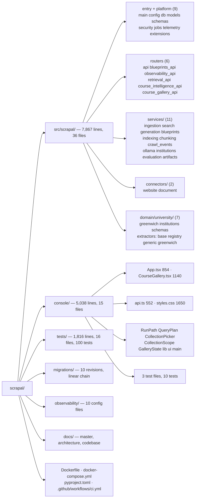

### 2.1 Internal dependency graph

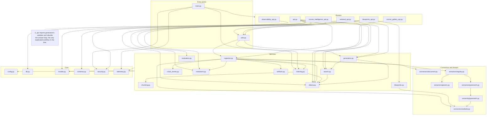

The graph is mostly acyclic and layered, which is the codebase's real strength: routers depend on services, services depend on core, and nothing points back up. Two exceptions are called out in their file entries — `retrieval_api.py` reaching into `generation.py` internals, and `ingestion.py` importing nine collaborators.

### 2.2 A request, end to end

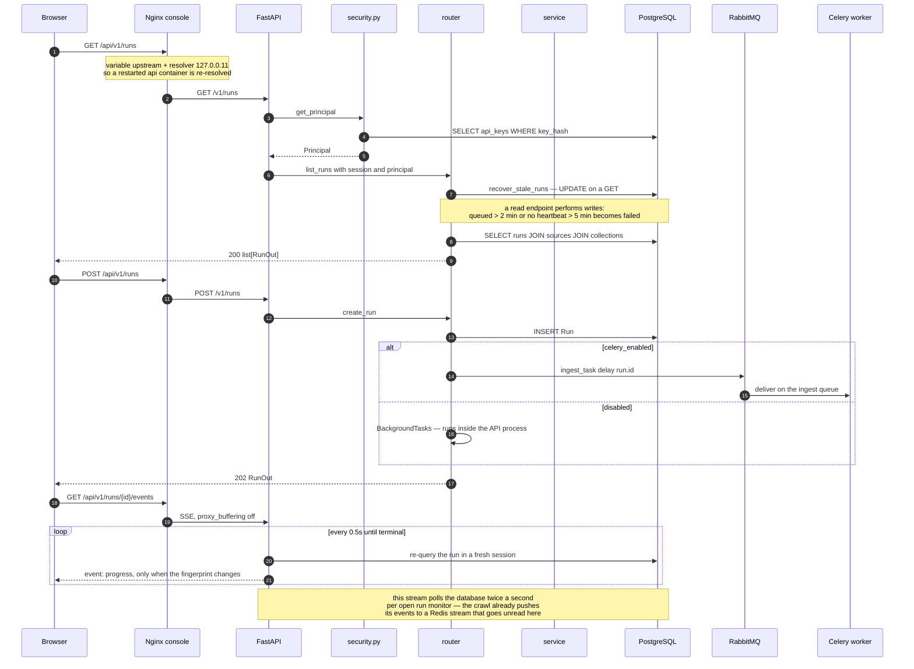

---

# Part I — Backend

## 3. Entry points and platform

### `src/scrapal/main.py` — 77 lines · coverage **0%**

**Does** — builds the FastAPI app, mounts six routers, and runs first-boot setup.

**Flow** — the `lifespan` context manager creates the artifact directory, calls `init_db()`, then `bootstrap_identity()` (first organization + super-admin key), `ensure_default_profile()` (the embedding profile), and seeds a "Greenwich launch collection" if no collection exists. After yield, nothing is torn down.

**Findings**
- **GAP** · 0% coverage. There is no test that the application starts. Every startup regression is found by hand.
- **GAP** · `init_db()` runs `Base.metadata.create_all` *and* the API container runs `alembic upgrade head`. Two schema authorities. On a fresh volume whichever runs first wins, and `create_all` will happily create tables Alembic then believes it must create.
- **MOD** · The collection seeding block imports `Organization` inline mid-function and uses a bare `assert`. Seeding belongs in a `bootstrap.py` beside `bootstrap_identity`, not in the app factory.
- **RISK** · No shutdown handling. The engine is never disposed, and in-flight `BackgroundTasks` are not drained.

### `src/scrapal/config.py` — 41 lines · coverage **100%**

**Does** — one `Settings` object from environment variables with the `SCRAPAL_` prefix, cached with `@lru_cache`.

**Findings**
- **GAP** · `api_key` defaults to `"scrapal-local-dev-key"`. A deployment that forgets to set it is silently wide open. This should have no default and fail closed outside development.
- **GAP** · The Ollama timeouts actually used in `ollama.py` (3, 90, 120, 180 seconds) are hardcoded there, not here. The one file whose job is configuration does not hold the values most likely to need tuning.
- **MOD** · Flat namespace mixing crawl limits, model names, telemetry and database. Nested models (`settings.crawl.max_pages`, `settings.llm.chat_model`) would make ownership obvious as this grows.

### `src/scrapal/db.py` — 49 lines · coverage **50%**

**Does** — the async engine, the session factory, `get_session` dependency, and `init_db`.

**Flow** — `init_db` creates the `vector` extension, runs `create_all`, then creates three indexes: an HNSW cosine index on `chunks.embedding`, a GIN index on `to_tsvector('english', chunks.content)`, and an HNSW index on `chunk_embeddings.embedding`.

**Findings**
- **GAP** · `chunks.embedding` still carries an HNSW index, but embeddings now live in `chunk_embeddings`. The retrieval path joins `ChunkEmbedding`; the `chunks.embedding` column and its index are legacy. Dead index, paid for on every write.
- **PERF** · The engine takes default pool settings. With `concurrency=2` workers plus the API, pool sizing is unconsidered rather than chosen.
- **MOD** · Index DDL inside `init_db` duplicates what migrations should own.

### `src/scrapal/models.py` — 566 lines · coverage **100%**

**Does** — 26 tables and 9 enums.

**Findings**
- The 100% coverage is misleading: these are class definitions, executed by import. No behaviour is asserted.
- **GAP** · `chunks.embedding` is still declared alongside `chunk_embeddings`. Two places to store a vector, one of them unused.
- **MOD** · One 566-line module holds tenancy, crawl, content, RAG and governance. Splitting into `models/` submodules per bounded context would make the domain boundaries visible — and would be a purely mechanical change.
- **RISK** · Every id is `String(36)`. Native `UUID` columns would be smaller and faster to index; this is a one-way door worth deciding deliberately.

### `src/scrapal/schemas.py` — 523 lines · coverage **98%**

**Does** — 36 Pydantic models: the API's response contracts.

**Findings**
- Genuinely well covered and the API never leaks an ORM object unshaped.
- **MOD** · `QueryPlan` (line 246) is a RAG domain object, not an HTTP schema. It belongs with retrieval.
- **GAP** · `SearchHit.page_number` is plumbed through the whole stack and is always `null` — see the `chunking.py` entry.

### `src/scrapal/security.py` — 74 lines · coverage **61%**

**Does** — API-key identity and three role gates.

**Flow** — `get_principal` hashes the supplied key with SHA-256, looks it up, and returns a `Principal`. `require_editor` and `require_super_admin` narrow by role.

**Findings**
- **GAP** · Plain SHA-256 with no salt and no work factor. Fine for a random 32-byte key, wrong the moment a human chooses one.
- **GAP** · `Principal.scopes` is stored, returned, and **never checked anywhere**. A whole authorisation dimension is decorative.
- **GAP** · No rate limiting, no key expiry, no last-used tracking, no audit of who changed what.
- **RISK** · Every organization's data is one `organization_id` filter away, and 18 endpoints do not write that filter (§7.2).
- **MOD** · The tenancy filter is hand-written into every query. One `ScopedSession` dependency that pre-filters by organization would make the safe path the default path instead of a convention.

### `src/scrapal/jobs.py` — 80 lines · coverage **58%**

**Does** — the Celery app, queue routing, and three tasks.

**Flow** — each task wraps its coroutine in `engine.dispose()` before and after, because Celery reuses a forked process while `asyncio.run()` makes a fresh event loop per task, and asyncpg connections belong to the loop that created them.

**Findings**
- **PERF** · Disposing the whole engine per task discards the connection pool every time. Correct, but it means every task pays full connection setup. A per-loop engine registry would keep the correctness and the pool.
- **GAP** · The `scheduler` (celery beat) container runs with an empty schedule. Recurring monitoring is deployed and inert.
- **GAP** · Retries cover only `ConnectionError`. A crawl that dies on a `TimeoutError` is not retried.

### `src/scrapal/telemetry.py` — 171 lines · coverage **79%**

**Does** — 12 Prometheus instruments, OTel tracing setup, structlog with secret redaction.

**Findings**
- The redaction regex covering `authorization|cookie|secret|token|password|api[_-]?key` is a genuinely good default.
- **MOD** · Metric definitions, logging config and tracing setup are three concerns in one file.
- **GAP** · `telemetry_retention_days` and `crawl_event_retention_days` exist in `Settings` and **nothing enforces them**. No pruning job exists, so `crawl_events` grows without bound.

### `src/scrapal/extensions.py` — 50 lines · coverage **63%**

**Does** — the `Connector` ABC, `ExtensionManifest`, and `extension_catalog()` scanning six entry-point groups.

**Findings**
- **GAP** · Six groups are scanned; only `scrapal.connectors` has entries. `schema_packs`, `extractors`, `ai_providers`, `agent_tools` and `exporters` are aspiration.
- **RISK** · `extension_catalog()` calls `point.load()`, importing arbitrary installed code, and it is reachable from `GET /v1/system` on every request with no caching.
- **PERF** · That import scan runs per request. It should be computed once at startup.

---

## 4. Routers

### `src/scrapal/api.py` — 774 lines · coverage **0%**

**Does** — the main `/v1` router: 25 endpoints across nine unrelated resource groups (system, collections, sources, runs, uploads, documents, search, records, conversations, action proposals).

**Flow** — three shared helpers do the tenancy work: `owned_collection`, `owned_run`, and `_proposal` each re-assert `organization_id`. `recover_stale_runs` marks runs failed when they have been queued for more than 2 minutes or have not sent a heartbeat for 5.

**Findings**
- **GAP — critical** · **0% coverage across 339 statements.** The largest and most-used router in the system has no automated test whatsoever. Every endpoint here is verified only by clicking the console.
- **GAP** · `approve_proposal` (line 707) is a **live bug**. The route is gated by `require_editor`, which admits `super_admin`, `admin` and `editor`. The body then raises 403 unless `principal.role != Role.admin` is false — that is, unless the role is *exactly* `admin`. The bootstrap key is `super_admin`, so **the only key the system creates for itself cannot approve an action proposal.** The Reviews view is unusable with a default install.
- **GAP** · `recover_stale_runs` performs `UPDATE`s inside `GET /runs` and `GET /runs/{id}`. A read endpoint mutates state, so two concurrent readers race on the same rows, and a plain page refresh can change data.
- **PERF** · `GET /runs/{id}/events` opens a new `SessionLocal()` and re-queries the run **twice a second** for the life of the stream. The crawl already publishes to a Redis stream (`scrapal:crawl-events`) that this endpoint ignores. Reading that stream would remove the polling entirely.
- **PERF** · `run_detail` fetches up to 100 `RunIssue` rows on every one of those 0.5s polls, then discards them unless the fingerprint changed.
- **GAP** · When `celery_enabled` is false, `create_run` uses `BackgroundTasks` but `retry_run_issues` and `approve_proposal` use bare `asyncio.create_task`, whose result is never awaited and whose exceptions vanish. Three code paths, three behaviours.
- **MOD — highest value** · This file should be six routers: `collections`, `sources`, `runs`, `documents`, `knowledge`, `conversations`, `proposals`. Nine resource groups sharing one module is the single clearest structural seam in the backend.

### `src/scrapal/blueprints_api.py` — 177 lines · coverage **65%**

**Does** — preview, patch, approve and run a crawl blueprint.

**Flow** — `preview` calls `services.blueprints.preview_blueprint` and stores a draft. `approve` resolves the institution, creates the `Source`, and marks the blueprint approved. `run` enqueues an ingest task.

**Findings**
- **GAP** · `preview` performs live network I/O inside the request. A slow target site holds a worker thread for up to 12 seconds per fetch with no overall deadline.
- **RISK** · Nothing rate-limits preview. It is an authenticated fetch-arbitrary-URL primitive; `validate_public_url` blocks private ranges but not volume.
- **MOD** · Approval does three things — resolve institution, create source, transition blueprint. That belongs in a service function, not in the route.

### `src/scrapal/course_intelligence_api.py` — 277 lines · coverage **36%**

**Does** — coverage overview, record listing, and the review/publish/reject workflow.

**Flow** — `overview` loads every course record for the scope and aggregates in Python. `publish_record` enforces the four-part gate (coverage 1, no missing fields, no contradictions, evidence for all 8 required fields) and enqueues a reindex.

**Findings**
- **RISK — high** · **Zero `organization_id` references in the entire module.** `collection_id`, `institution_id` and `record_id` are all caller-supplied and validated against nothing but existence. Behind `require_super_admin` with one organization this is currently safe; with two organizations a super-admin of one reads and *mutates* the other's records.
- **PERF** · `overview` loads all matching `StructuredRecord` rows to compute counts and averages. Those are `COUNT`, `AVG` and `GROUP BY` — they belong in SQL. At 224 records it is imperceptible; it is linear in catalogue size.
- **PERF** · `records` caps at 500 with no pagination cursor. Above 500 courses in one filter, the rest are unreachable through the API.
- **MOD** · `institution_breakdown` and the coverage aggregation are reporting logic sitting in a router.

### `src/scrapal/course_gallery_api.py` — 513 lines · coverage **63%**

**Does** — published-course discovery: interpretation, filtering, faceting, dossiers, shortlist.

**Flow** — every read path calls `_published_courses`, which loads **all** published courses for the organization and maps each to a dict including its full evidence blob. Filtering, faceting, sorting and pagination then happen in Python.

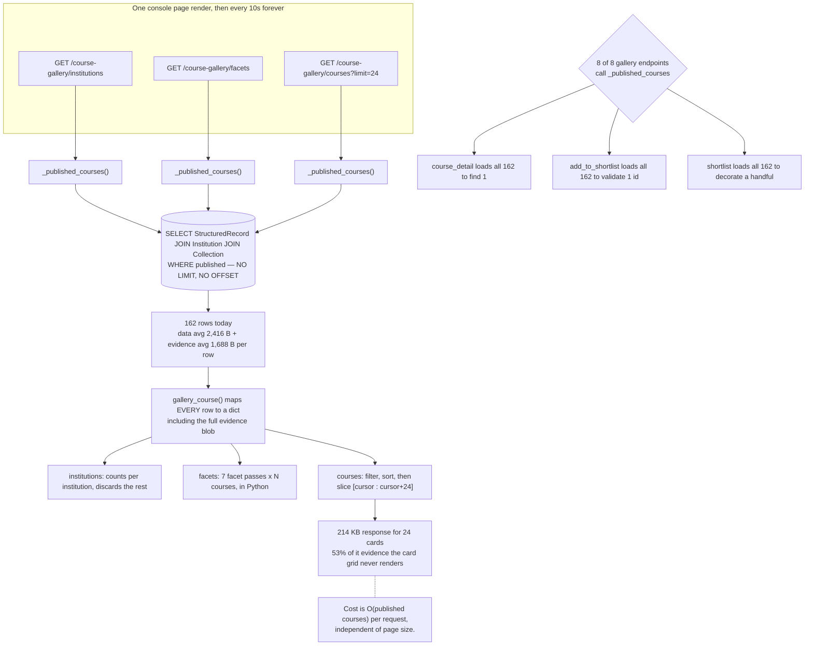

**Findings**
- **PERF — highest value in the codebase** · `_published_courses` is called from **8 of 8** read paths. `course_detail` loads the whole catalogue to return one course. `add_to_shortlist` loads the whole catalogue to validate one id. `shortlist` loads the whole catalogue to decorate a handful of rows. Cost is O(published courses) per request, independent of the page requested.
- **PERF** · Measured: `GET /courses?limit=24` returns **214,265 bytes** for 24 cards, of which **113,700 bytes (53.1%)** is `evidence` that the card grid never renders. A list projection without evidence would roughly halve the payload.
- **PERF** · `gallery_facets` runs 7 facet passes over every course, and `matches_gallery_filters` re-runs per facet with `omit=`. That is 7×N filter evaluations in Python per `/facets` call, which the console requests every 10 seconds.
- **MOD** · Four distinct concerns in one file: HTTP routing, the model-interpretation guard, the filter/facet engine, and shortlist persistence. The filter engine in particular is pure and testable and should be its own module — or, better, SQL.
- **GAP** · `principal_key` falls back to `f"{organization_id}:{role}"` when `key_id` is absent, so two keys with the same role would share a shortlist.

### `src/scrapal/retrieval_api.py` — 223 lines · coverage **0%**

**Does** — Retrieval Lab traces, embedding profile management, evaluations.

**Findings**
- **GAP** · 0% coverage over 100 statements, including `activate_profile`, which changes which embeddings the whole system searches.
- **RISK** · `GET /runs/{run_id}` fetches a `RetrievalRun` by primary key with no organization check, even though the row has an `organization_id`.
- **MOD — clear duplication** · `_generate_lab_answer` (line 67) rebuilds the grounded-answer loop that `generation.py` already implements: build evidence catalog, prompt, call the model, split sentences, validate each, assemble. It shares `validate_sentence_support` but duplicates everything around it, including its own fast-model fallback that the main path does not have. **These should be one `answering` service** — today a change to citation policy must be made twice.

### `src/scrapal/observability_api.py` — 243 lines · coverage **0%**

**Does** — fleet overview, run listings, timelines, event search, incidents, workers, dependency health.

**Findings**
- **RISK — high** · **No tenant filtering on any of the 10 endpoints.** `overview` counts runs, pages, failures and incidents across every organization. `observability_runs` selects all runs and *returns* `organization_id` without ever filtering on it. This is the clearest cross-tenant leak in the codebase.
- **GAP** · 0% coverage over 136 statements.
- **PERF** · `overview` computes p95 page duration by loading **every** matching `duration_ms` value into Python and sorting it. Over a 720-hour window that is every page event in a month. PostgreSQL has `percentile_cont`.
- **PERF** · Seven sequential `COUNT` queries per overview call, each a separate round trip, where one query with `FILTER` clauses would do.

> **Reproduced live, then cleaned up.** Creating an action proposal and approving it with the bootstrap key returns
> `HTTP 403 {"detail":"Administrator approval required"}`. The key's role is `super_admin`; the check demands exactly `admin`.

---

## 5. Services

### `src/scrapal/services/ingestion.py` — 719 lines · coverage **33%**

**Does** — the crawl engine. The largest module in the codebase and, at 217 uncovered statements, the least tested relative to its complexity.

**Flow** — documented as diagrams 6 and 7 in [`ARCHITECTURE.md`](ARCHITECTURE.md). `ingest_run` is the task boundary; `_ingest_source` (260 lines, 28 branches) is the page loop; `persist_extraction` handles versioning; `persist_structured_records` handles records.

**Findings**
- **GAP — critical** · 33% coverage on the component with the most failure modes. `tests/test_ingestion_resilience.py` is **13 lines**. The savepoint isolation, the 6-attempt terminal retry, cancellation, the retry frontier, and the LLM budget are all untested.
- **MOD — clearest seam in the backend** · `_ingest_source` mixes six responsibilities: connector selection, frontier construction, robots policy, fetching, extraction dispatch, and link expansion. Each is independently testable once separated. The proposed split is in §8.
- **PERF** · The crawl is strictly sequential — one page at a time, `await` on each fetch. A 500-page crawl of a well-behaved site is bounded by round-trip latency, not by politeness. A bounded-concurrency worker pool with per-host rate limiting would be a large win and is the reason `max_pages_per_run=500` feels slow.
- **PERF** · `await session.refresh(run, ["cancel_requested"])` issues a database round trip **per page** purely to check a boolean.
- **PERF** · `record_crawl_event` runs a `MAX(sequence)` subquery per event, and a single page emits 4–6 events. That is 4–6 extra queries per page on top of the work.
- **GAP** · `chunk_text(extracted.get("text",""))` is called a second time in the loop purely to *count* chunks for an event, duplicating work `index_document_version` already did.
- **GAP** · The `except Exception` around the savepoint marks a page failed without distinguishing transient from permanent. See the `indexing.py` entry for what that costs.

### `src/scrapal/services/search.py` — 523 lines · coverage **43%**

**Does** — three-lane hybrid retrieval and fusion.

**Flow** — plan, then structured / lexical / vector lanes, then reciprocal rank fusion with a per-document cap.

**Findings**
- **GAP — critical** · `retrieve_knowledge` is **285 lines with 32 branches**, the single most complex function in the codebase, at 43% coverage. Both PostgreSQL branches (`websearch_to_tsquery`, `ts_rank_cd`, pgvector `cosine_distance`) are **never executed by any test** — the suite runs on SQLite and always takes the fallback path.
- **PERF** · The structured lane loads up to **500 `StructuredRecord` rows** and scores them in Python with `record_matches_plan`, on every query. That is the full published catalogue deserialised per search.
- **PERF** · The lanes run sequentially. Structured and lexical are independent database queries and the vector lane's only dependency is the embedding call — `asyncio.gather` would cut wall-clock latency materially.
- **MOD** · One function owns planning, three lanes, bridging, fusion, capping, persistence and result shaping. Each lane is a natural module with an obvious interface: `(query, plan, scope) -> list[Candidate]`.
- **GAP** · `cosine()` is hand-implemented in Python for the SQLite path — dead weight in production and a source of drift from pgvector's semantics.

### `src/scrapal/services/generation.py` — 470 lines · coverage **60%**

**Does** — grounded answer generation with per-sentence citation validation.

**Findings**
- The withheld-sentence design — dropping unsupported text and reporting only the reason — is one of the strongest ideas in the codebase.
- **MOD** · Shares its purpose with `retrieval_api._generate_lab_answer`. One `answering` service should own prompt construction, streaming, validation and assembly.
- **PERF** · `append_generation_event` writes a row per event and publishes to Redis; token-level streaming multiplies this.
- **GAP** · Sentence splitting is a regex. An abbreviation or a decimal inside a citation-bearing sentence can split it and cause a spuriously withheld clause.

### `src/scrapal/services/indexing.py` — 164 lines · coverage **79%**

**Does** — chunk, embed, and track index state per document version.

**Findings**
- **GAP — critical, with live evidence** · The handler distinguishes `OllamaUnavailable` (→ `waiting`, resumable) from `Exception` (→ `failed`, terminal). The Redis lock inside `OllamaService.workload()` raises a **raw `redis.ConnectionError`**, which is not `OllamaUnavailable`, so a Redis blip is recorded as a *permanent* failure. On the live database: **81 document indexes sit in `failed` with `ConnectionError: Error -2 connecting to redis:6379`**, plus 3 in `waiting`. Together, **86 chunks across 80 documents have no embedding and are invisible to the semantic lane.**
- **GAP** · **Nothing ever retries them.** `reindex_task` exists but is only triggered by a course publish. There is no reconciliation job scanning for `waiting` or `failed` indexes, so both states are terminal in practice.
- **PERF** · All chunks for a version are embedded in one call with no batching. A large document sends one enormous request; a failure loses the whole document's work.
- **MOD** · Chunking policy, embedding orchestration and index bookkeeping are three concerns.

### `src/scrapal/services/chunking.py` — 61 lines · coverage **100%**

**Does** — split document text into overlapping chunks.

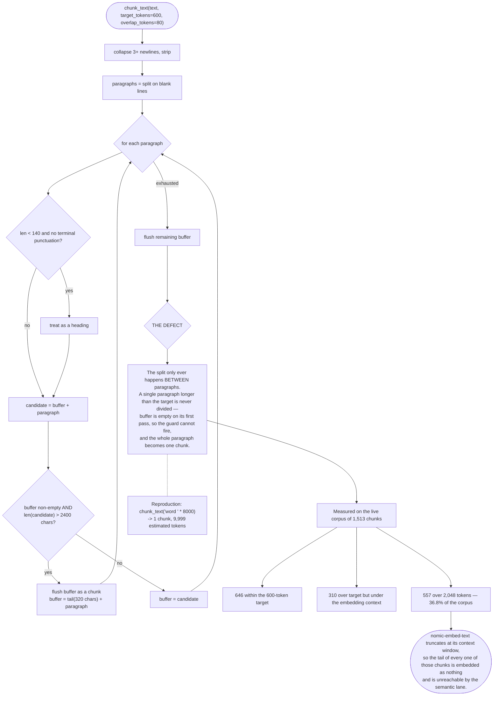

**Findings**
- **GAP — highest-impact defect found** · The splitter only ever divides **between** paragraphs. When a single paragraph exceeds the target, the `if buffer and len(candidate) > target_chars` guard cannot fire on its first pass — `buffer` is empty — so the whole paragraph becomes one chunk. `trafilatura` routinely emits a section as one block, so this is the common case, not the edge case.
  - **Measured on the live corpus of 1,513 chunks:** 646 within the 600-token target, 310 over target, and **557 (36.8%) above 2,048 tokens** — beyond `nomic-embed-text`'s context window. Average 1,558 tokens against a 600 target; maximum 6,951.
  - **Consequence:** the embedding model truncates at its context limit, so **the tail of more than a third of the corpus is embedded as nothing and cannot be found by the semantic lane.** No error is raised; retrieval just quietly misses.
  - **Reproduction:** `chunk_text('word ' * 8000)` returns **1 chunk of 9,999 estimated tokens**.
- **GAP** · `estimated_tokens` is `len(text) // 4` — a character heuristic, not a tokenizer. Even a corrected splitter would only approximate the model's real limit.
- **GAP** · `page_number` is a field on `TextChunk`, on `Chunk`, on `SearchHit`, and in the citation payload — and **is never assigned**. `DocumentConnector` extracts per-page PDF text into `extracted["pages"]`; `persist_extraction` discards it; `chunk_text` never receives it. Live database: **0 of 1,513 chunks have a page number.** An entire PDF-citation feature is wired end to end except for its source.
- **This file has 100% line coverage.** It is the clearest demonstration in the repository that coverage measures lines executed, not properties asserted. A single property test — *no chunk exceeds the target* — would have caught all of this.

### `src/scrapal/services/blueprints.py` — 309 lines · coverage **34%**

**Does** — sample a site and project field coverage before a bulk crawl.

**Findings**
- **PERF** · `_sample_pages` fetches up to 16 pages; concurrency is worth confirming under a slow target.
- **GAP** · `classify_page_type` and `suggested_patterns` encode the same URL heuristics that `generic.py` encodes in `COURSE_URL_HINTS`. **Two independent notions of "this URL looks like a course"** that can disagree — and the Westminster incident happened inside exactly this gap: the blueprint proposed `/study/` and the extractor accepted it.
- **MOD** · URL classification should be one shared module used by both the planner and the extractor.

### `src/scrapal/services/ollama.py` — 216 lines · coverage **29%**

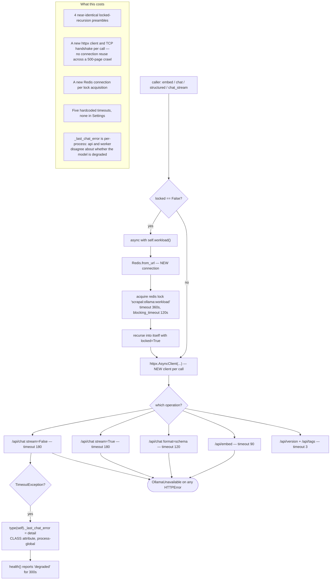

**Findings**
- **PERF** · A **new `httpx.AsyncClient` per call**. Across a 500-page crawl with a model pass per page that is hundreds of discarded connection pools and TLS handshakes. One shared client is a small change with a broad effect.
- **PERF** · A **new Redis connection per `workload()` acquisition**, and `workload()` wraps almost every call.
- **MOD** · The `if not locked: async with self.workload(): return await self.method(..., locked=True)` preamble is repeated in all four public methods. One decorator removes it.
- **GAP** · `_last_chat_error` is a **class attribute** mutated through `type(self)`. It is per-process, so the API and the worker disagree about whether the model is degraded, and `GET /v1/system` reports whichever process answered.
- **GAP** · Five hardcoded timeouts (3, 90, 120, 180, 180) that belong in `Settings`.
- **GAP** · `import asyncio` inside `_gather` at module bottom.
- **GAP** · 29% coverage on the component every AI path depends on.

### `src/scrapal/services/crawl_events.py` — 174 lines · coverage **33%**

**Findings**
- **PERF** · `MAX(sequence)` subquery per event; a sequence allocated in Python or a database sequence would remove it.
- **GAP** · No pruning despite `crawl_event_retention_days = 90` existing in `Settings`. The table grows forever.
- The best-effort Redis publish, wrapped so a stream outage is a warning, is correct and worth preserving.

### `src/scrapal/services/institutions.py` — 61 lines · coverage **100%**

Small, well covered, single-purpose. **The model for what the other services should look like.** Its only note: the slug-uniqueness loop issues one query per collision attempt, which is fine at this scale.

### `src/scrapal/services/evaluation.py` — 74 lines · coverage **0%**

**GAP** · The component whose entire job is measuring retrieval quality is itself unmeasured.

### `src/scrapal/services/artifacts.py` — 14 lines · coverage **100%**

**Findings**
- **PERF** · `path.write_bytes` is **synchronous file I/O inside async request and worker paths**, blocking the event loop for the duration of every page write.
- **GAP** · Artifacts are never deleted. No retention, no reference counting, no orphan collection. The volume grows for the life of the deployment.
- **GAP** · No `fsync`, and no atomic write via a temp file and rename, so a crash mid-write leaves a truncated artifact whose name claims a hash it does not have.

---

## 6. Connectors and domain

### `src/scrapal/connectors/website.py` — 119 lines · coverage **57%**

**Does** — the website connector plus every crawl-safety primitive: `validate_public_url`, `robots_allowed`, `allowed_link`, `extract_links`.

**Findings**
- **RISK** · `validate_public_url` resolves the hostname and rejects private addresses, then the fetch resolves **again**. The window between the two is a classic DNS-rebinding TOCTOU. Pinning the validated address for the connection would close it.
- **GAP** · `robots_allowed` returns `False` on `httpx.HTTPError` (fail-closed, good) but `True` on any 4xx/5xx from `robots.txt` (fail-open). A site returning 503 for `/robots.txt` is treated as fully permissive.
- **PERF** · `robots.txt` is **re-fetched for every URL** — no caching at all. A 500-page crawl of one host makes 500 identical robots requests. Caching per host for the run's duration removes 499 of them. **This is the cheapest meaningful crawl speedup available.**
- **MOD** · SSRF validation, robots policy, link filtering and content extraction are four concerns in one 119-line file.

### `src/scrapal/connectors/document.py` — 54 lines · coverage **50%**

**Does** — parse uploaded PDF, DOCX, HTML, Markdown and text.

**Findings**
- **GAP** · Extracts per-page PDF text into `pages` that **no caller reads** — the dead end behind the missing `page_number`.
- **GAP** · DOCX extraction reads `document.paragraphs` only: tables, headers and footers are silently dropped.
- **PERF** · `PdfReader` and `WordDocument` are synchronous and CPU-bound, called from async paths without a thread pool.

### `src/scrapal/domain/university/greenwich.py` — 282 lines · coverage **96%**

**Does** — the site-specific Greenwich connector and extractor, relying on stable anchor ids.

**Findings**
- Well covered, and correctly quarantined behind the registry.
- **MOD** · Its `extract` is 222 lines with 21 branches — the third most complex function in the codebase. It is well tested, so it is *safe* to refactor, but its shape is a warning about what per-site extractors become.

### `src/scrapal/domain/university/extractors/generic.py` — 519 lines · coverage **93%**

**Does** — the site-agnostic course extractor: structural passes, then a bounded model pass, then evidence verification.

**Findings**
- The best-engineered module in the codebase: high coverage, explicit evidence, and a model pass that cannot introduce an unverifiable claim.
- **GAP** · `_looks_like_a_course` is a heuristic tuned against the universities seen so far. Each new institution is evidence, not proof, and `NOT_A_COURSE_URL_HINTS` is a denylist that grows by incident.
- **MOD** · Shares URL classification with `blueprints.py` (above) — the shared vocabulary belongs in one module.
- **PERF** · `model_pass` issues up to `max_llm_fields` (8) **sequential** model calls per page. Batching them into one structured request would cut per-page model latency substantially, and this is the dominant cost of a model-assisted crawl.

### `extractors/base.py` (34) · `registry.py` (28) · `extractors/greenwich.py` (18) — coverage **100%**

Three small, sharp files. `base.py`'s `verify_excerpt` is the guarantee that a model cannot smuggle an unsupported fact into a published record. `registry.py` is the seam that decoupled extraction from connectors. **No findings — this is the shape to copy.**

### `src/scrapal/domain/university/institutions.py` (108) · `schemas.py` (75) — coverage **100%**

Domain vocabulary: domain parsing, slugs, country inference, and the `CourseIntelligenceRecord` contract with its 8 required fields. Clean.

---

# Part II — Frontend

### `console/src/App.tsx` — 854 lines

**Does** — the shell plus seven of the nine views inline.

**Findings**
- **MOD — clearest frontend seam** · One file holds `App`, `Overview`, `Sources`, `Knowledge`, `CourseIntelligence`, `CourseEvidenceLedger`, `RetrievalLab`, `RetrievalTrace`, `Reviews`, `Settings`, `Observability`, `AgentPanel`, `AddSource`, `BlueprintPreview`, `RunMonitor`, `EventTimeline` and a dozen helpers. Each view should be its own file; nothing shares state except through props and the query client.
- **GAP** · No test file. Zero coverage of any view.
- **GAP** · The Reviews view drives `approve_proposal`, which returns 403 for the default key (§4). The UI has no way to succeed.

### `console/src/main.tsx` — 22 lines

**Findings**
- **PERF — broad effect** · `refetchInterval: 10_000` is set as a **global default for every query**. Combined with the O(catalogue) gallery endpoints, one idle open tab re-fetches the entire published catalogue three times every ten seconds. Per-query intervals — or `staleTime` plus ETags — would remove nearly all of it.

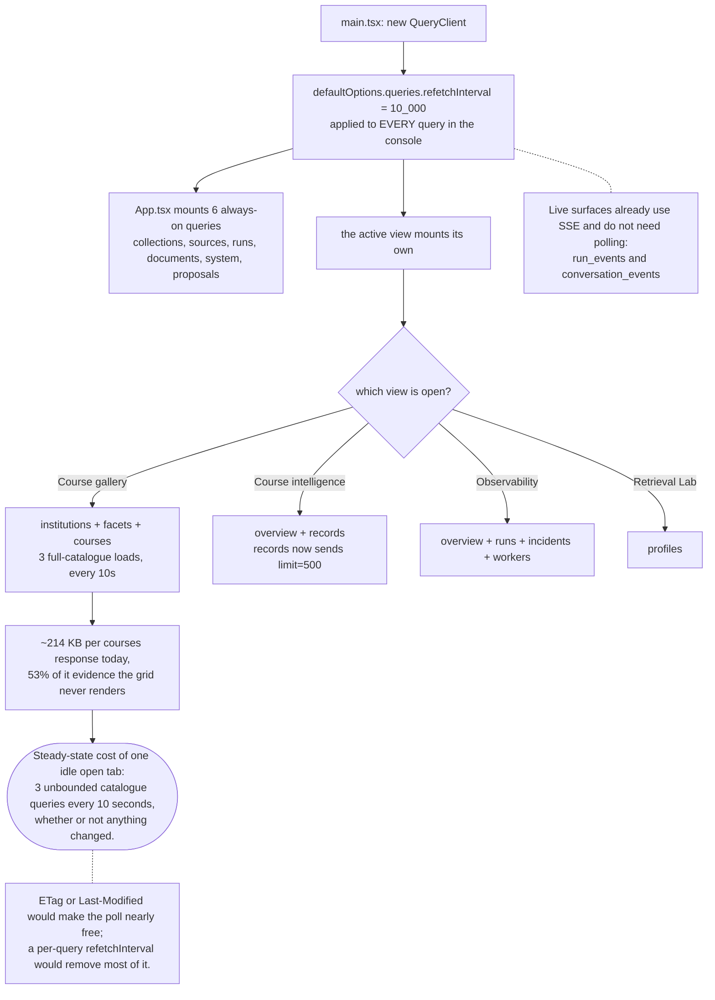

### `console/src/CourseGallery.tsx` — 1,140 lines

**Findings**
- **MOD** · The largest frontend file: filter bar, popovers, fee range, cards, dossier, compare, skeletons and ~15 formatting helpers. The pure helpers (`feeRange`, `money`, `factsFor`, `keyFacts`, `brandOf`) are trivially extractable and testable.
- **GAP** · No test coverage of filter or compare behaviour.

### `console/src/api.ts` — 552 lines

**Does** — the typed HTTP client and every response type.

**Findings**
- **RISK — deployment blocker** · `VITE_API_KEY` is baked into the bundle at build time. **Confirmed: `scrapal-local-dev-key` is present in the shipped JavaScript inside the running console container.** Anyone who can load the page holds a super-admin API key. This is a deliberate local-dev tradeoff, and it means the console cannot be exposed beyond a trusted network without a session-based auth layer.
- **MOD** · Types and transport in one file; the types are the API contract and want to be generated from the OpenAPI schema rather than hand-maintained.

### `CollectionScope.ts` (60) · `GalleryState.ts` (70) · `lib.ts` (116) · `ui.tsx` (18) · `CollectionPicker.tsx` (24) · `RunPath.tsx` (119) · `QueryPlan.tsx` (64)

The healthy part of the frontend: small, single-purpose, and the only modules with tests (10 across three files). `lib.ts` carries genuinely valuable hard-won knowledge — the `crypto.randomUUID` fallback for non-secure contexts and the `useDialog` ref indirection that stopped ten-second refetches from stealing focus mid-sentence.

### `console/src/styles.css` — 1,650 lines

**MOD** · A single stylesheet for the whole console with no layering or scoping. Splitting per view alongside the component split is the natural companion change.

---

# Part III — Infrastructure

### `Dockerfile` · `console/Dockerfile` · `nginx.conf`

**Findings**
- **PERF** · Backend image is **667 MB**, site-packages alone **369 MB**.
- **GAP** · Four declared dependencies have **zero imports in `src/`**: `scrapy`, `langgraph`, `markdownify`, `ollama` (the code calls Ollama over raw HTTP). Measured in the running image: scrapy 3.4 MB plus twisted 34 MB, langgraph 2.4 MB plus langchain-core 5.6 MB, markdownify 64 KB, ollama 168 KB — **roughly 46 MB of dead weight**, with `cryptography` (15 MB) likely reachable only through scrapy's `service-identity`.
- **GAP** · The backend image is single-stage and keeps `gcc`, `libxml2-dev` and `libxslt1-dev` in the runtime layer. A builder stage would drop the toolchain.
- **GAP** · `console/Dockerfile` copies only `package.json` and runs `npm install`, not `npm ci` with the lockfile. **Console builds are not reproducible** — CI uses `npm ci`, the image does not.
- The `nginx.conf` variable-upstream trick with `resolver 127.0.0.11` is correct and well explained; keep it.

### `docker-compose.yml`

- Health-gated dependencies and the `observability` profile split are both good.
- **RISK** · Default credentials throughout (`scrapal:scrapal`, `admin/scrapal-local`) and Postgres has no host port published, which is right.
- **GAP** · No resource limits on any service. A runaway crawl can starve the host.

### `pyproject.toml` · `.github/workflows/ci.yml`

**Findings**
- Ruff and mypy are configured strictly (`disallow_untyped_defs`), and both pass.
- **GAP — significant** · CI runs `npm ci` and `npm run build` for the console but **never `npm test` or `npm run lint`.** The console's 10 tests do not run in CI.
- **GAP — significant** · The backend job runs `pytest` with **no PostgreSQL service**. Every test uses in-memory SQLite, so the tsvector, `ts_rank_cd`, pgvector and HNSW paths are **never exercised in CI**. The production database engine is untested.
- **GAP** · No Docker build in CI, no migration test, no coverage threshold — 58% can fall without failing the build.

### `migrations/` — 10 revisions

A clean linear chain, `0001_initial` → `0010_course_gallery_shortlist`, with no branches. `0008_quarantine_legacy_courses` is a good example of a data migration that repairs records rather than dropping them.

**Findings**
- **GAP** · No migration is tested. There is no `upgrade head` → `downgrade base` round-trip check.
- **GAP** · `init_db`'s `create_all` competes with Alembic for schema authority (§3).

### `observability/` — 10 config files

Prometheus with alert rules, Alertmanager, Loki, Tempo, an OTel collector, and two provisioned Grafana dashboards. Complete and coherent — but gated behind an opt-in profile, so the default developer experience has no dashboards.

---

# Part IV — Tests

**100 tests, 1,816 lines, 58% coverage, 11.35s.** Fast and genuinely useful where it exists.

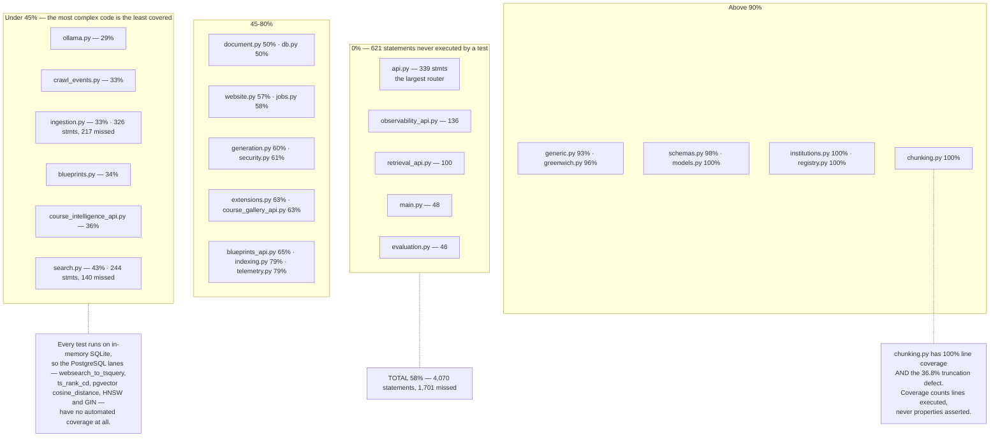

**The coverage is inverted.** The best-covered modules are the simplest, and the least-covered are the most complex:

| Module | Statements | Coverage | Complexity |
|---|---|---|---|
| `api.py` | 339 | **0%** | 25 endpoints |
| `observability_api.py` | 136 | **0%** | 10 endpoints |
| `retrieval_api.py` | 100 | **0%** | profile activation |
| `evaluation.py` | 46 | **0%** | — |
| `ingestion.py` | 326 | **33%** | 260-line loop, 28 branches |
| `search.py` | 244 | **43%** | 285-line function, 32 branches |
| `ollama.py` | 117 | **29%** | every AI path |
| `generic.py` | 268 | **93%** | well covered |
| `models.py` / `schemas.py` | 823 | **100% / 98%** | declarations |

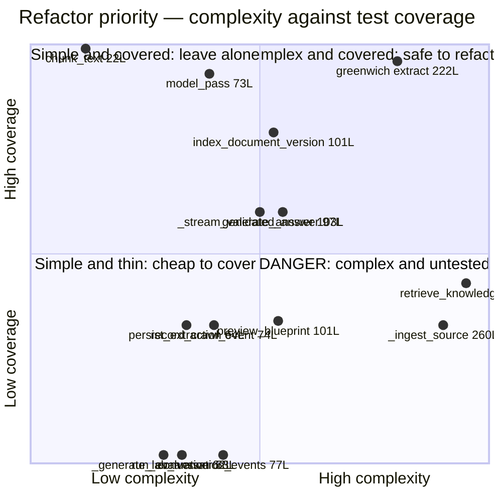

**Findings**
- **GAP** · `test_ingestion_resilience.py` is 13 lines for the most failure-prone component in the system.
- **GAP** · No test uses PostgreSQL, so half of `search.py` — the half that runs in production — is never executed.
- **GAP** · No API-level tests: no router is exercised through `TestClient`.
- **GAP** · No property-based tests. The chunking defect is exactly what one property — *no chunk exceeds the target* — would have caught, in a file with 100% line coverage.

---

# Part V — Findings

## 7. Gap register

Ranked by expected damage, not by effort.

### 7.1 Correctness defects with live evidence

| # | Finding | Evidence | Fix |
|---|---|---|---|
| **G1** | **Chunking never splits inside a paragraph.** 36.8% of the corpus exceeds the embedding context and is silently truncated. | 557 of 1,513 chunks > 2,048 tokens; avg 1,558 vs 600 target; max 6,951. `chunk_text('word '*8000)` → 1 chunk. | Split oversized paragraphs on sentence boundaries, then re-embed. Add a property test asserting the bound. |
| **G2** | **Transient Redis errors are recorded as permanent index failures.** The Redis lock raises `redis.ConnectionError`, which is not `OllamaUnavailable`, so it falls to the `except Exception` branch and is marked `failed` rather than `waiting`. | 81 indexes `failed` with `ConnectionError: Error -2 connecting to redis:6379`; 86 chunks across 80 documents have no embedding. | Classify connection errors as retryable, and add a reconciliation job — today both `waiting` and `failed` are terminal because nothing retries. |
| **G3** | **`approve_proposal` rejects the only key the system creates.** Gated by `require_editor`, then demands role *exactly* `admin`; the bootstrap key is `super_admin`. | Reproduced live: `HTTP 403 "Administrator approval required"`. | `if principal.role not in {Role.super_admin, Role.admin}`. |
| **G4** | **PDF page citations are dead.** `DocumentConnector` produces per-page text; `persist_extraction` discards it; `chunk_text` never sets `page_number` — which is plumbed through search, generation and the API. | 0 of 1,513 chunks carry a page number. | Thread `pages` into chunking, or delete the field from all five layers. |
| **G5** | **`chunks.embedding` is a dead column with a live HNSW index.** Embeddings moved to `chunk_embeddings`; 384 stale rows remain and every write pays for the index. | No code writes it; `ix_chunks_embedding_hnsw` still exists. | Drop the column and the index in a migration. |

### 7.2 Tenancy and security

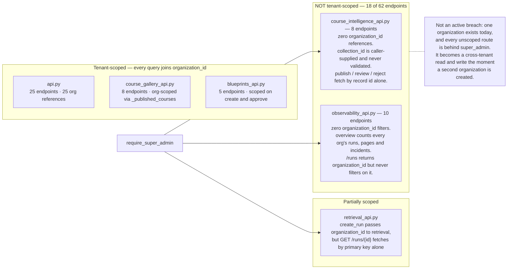

| # | Finding | Evidence |
|---|---|---|
| **G6** | **18 of 62 endpoints have no tenant scoping.** `course_intelligence_api.py` (8) has zero `organization_id` references and accepts unvalidated `collection_id`; `observability_api.py` (10) filters nothing and counts across all organizations. `retrieval_api.GET /runs/{id}` fetches by primary key alone. | Not an active breach — one organization exists and all are behind `require_super_admin`. It becomes a cross-tenant read *and write* the moment a second organization is created. |
| **G7** | **The super-admin API key ships inside the browser bundle.** | Confirmed: `scrapal-local-dev-key` is present in the JS served by the running console container. Blocks any deployment beyond a trusted network. |
| **G8** | `Principal.scopes` is stored and returned but **never checked anywhere**. | Whole authorisation dimension is decorative. |
| **G9** | API keys: unsalted SHA-256, no expiry, no rate limiting, no last-used tracking, no audit trail. | |
| **G10** | `SCRAPAL_API_KEY` defaults to a known value. A deployment that forgets to set it is open. | |

### 7.3 Testing

| # | Finding |
|---|---|
| **G11** | **621 statements at 0% coverage**, including the 339-statement main router. No endpoint is tested through `TestClient`. |
| **G12** | **Every test runs on SQLite.** The PostgreSQL lanes in `search.py` — the ones that run in production — are never executed. CI has no Postgres service. |
| **G13** | CI never runs the console's tests or linter. |
| **G14** | No coverage threshold, no migration round-trip test, no Docker build in CI. |
| **G15** | `chunking.py` has 100% line coverage and shipped G1. Coverage is not correctness; there are no property tests. |

### 7.4 Operational

| # | Finding |
|---|---|
| **G16** | **Nothing enforces retention.** `crawl_event_retention_days=90` and `telemetry_retention_days=14` exist in `Settings`; no pruning job exists. `crawl_events` grows forever. |
| **G17** | **Artifacts are never collected.** No retention, no reference counting, no orphan sweep. |
| **G18** | The `scheduler` container runs celery beat with an empty schedule. |
| **G19** | `main.py`'s `create_all` competes with Alembic for schema authority. |
| **G20** | `robots.txt` fail-open on 4xx/5xx; DNS-rebinding TOCTOU between `validate_public_url` and the fetch. |
| **G21** | No resource limits on any container. |

## 8. Optimisation register

Ordered by measured or clearly-reasoned impact against effort.

| # | Target | Cost today | Change | Expected effect |
|---|---|---|---|---|
| **O1** | **`robots.txt` re-fetched per URL** in the crawl loop | 500 identical HTTP requests per 500-page single-host crawl | Cache per host for the run | Removes 499 requests per crawl. **Cheapest large win in the codebase.** |
| **O2** | **Gallery loads the whole catalogue on every request** | `_published_courses` called from 8 of 8 read paths; O(catalogue) regardless of page size | Move filtering, faceting, sorting and pagination into SQL | O(page) instead of O(catalogue) |
| **O3** | **Evidence blobs in list responses** | Measured: 214,265 B for 24 cards, **53.1% evidence** the grid never renders | Separate list and detail projections | ~2× payload reduction, immediately |
| **O4** | **Console polls everything every 10s** | Global `refetchInterval`; with O2 unfixed, three full-catalogue loads per 10s per idle tab | Per-query intervals, `staleTime`, ETags | Near-elimination of idle load |
| **O5** | **Sequential crawl** | One page at a time, bounded by round-trip latency | Bounded-concurrency pool with per-host rate limiting | Large throughput gain; the reason 500 pages feels slow |
| **O6** | **New httpx client and Redis connection per Ollama call** | Hundreds of discarded pools and handshakes per crawl | One shared pooled client; one Redis pool | Lower latency and fewer sockets on every AI path |
| **O7** | **Sequential model calls in `model_pass`** | Up to 8 per page | One batched structured request | Dominant cost of model-assisted extraction |
| **O8** | **Retrieval lanes run sequentially** | Structured, lexical and vector one after another | `asyncio.gather` the independent lanes | Direct wall-clock cut on every search |
| **O9** | **Structured lane loads 500 records per query** and scores in Python | Full catalogue deserialised per search | Push scoring into SQL or pre-compute a search vector | Removes the per-query catalogue read |
| **O10** | **`MAX(sequence)` subquery per crawl event** | 4–6 extra queries per page | Database sequence or in-process counter | Meaningful over 500 pages |
| **O11** | **`session.refresh(run, ['cancel_requested'])` per page** | One round trip per page to read a boolean | Check every N pages, or use the Redis stream | |
| **O12** | **`recover_stale_runs` writes during `GET`** | `UPDATE` on every run listing; readers race | Move to a periodic task | Removes write contention from reads |
| **O13** | **SSE polls the database twice a second** | Per open run monitor; the Redis event stream is ignored | Consume `scrapal:crawl-events` | Removes the poll entirely |
| **O14** | **p95 computed in Python** | Loads every `duration_ms` in the window | `percentile_cont` in PostgreSQL | Constant memory |
| **O15** | **Seven sequential COUNTs per observability overview** | Seven round trips | One query with `FILTER` clauses | |
| **O16** | **46 MB of unused dependencies** | scrapy+twisted 37 MB, langgraph+langchain-core 8 MB, plus markdownify and ollama | Remove them; add a builder stage | Smaller image, faster pulls, less CVE surface |
| **O17** | **Synchronous file and PDF I/O in async paths** | `write_bytes`, `PdfReader`, `WordDocument` block the loop | `run_in_executor` | Removes event-loop stalls |
| **O18** | **`chunk_text` called twice per page** | Once to index, once only to count for an event | Return the count from indexing | |
| **O19** | **`extension_catalog()` imports plugins per request** | Runs on every `GET /v1/system` | Compute once at startup | |
| **O20** | **`engine.dispose()` per Celery task** | Discards the pool every task | Per-event-loop engine registry | Keeps the correctness, keeps the pool |

## 9. Modularisation plan

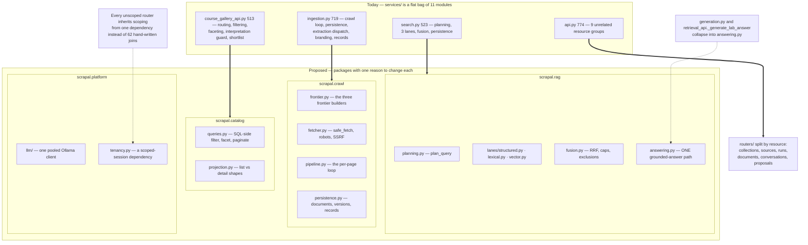

### 9.1 What wants to move, and why

| Seam | Today | Proposed | Why |
|---|---|---|---|
| **`scrapal.crawl`** | `ingestion.py`, 719 lines, 33% covered; `_ingest_source` is 260 lines / 28 branches | `frontier.py`, `fetcher.py`, `pipeline.py`, `persistence.py` | Six responsibilities in one loop. Each is independently testable; none is testable now. |
| **`scrapal.rag`** | `search.py` 523 + `generation.py` 470 + duplicate answer loop in `retrieval_api.py` | `planning.py`, `lanes/{structured,lexical,vector}.py`, `fusion.py`, `answering.py` | `retrieve_knowledge` is 285 lines / 32 branches. Each lane has the same obvious signature. **`answering.py` deletes a real duplication** — citation policy currently lives in two places. |
| **`scrapal.catalog`** | `course_gallery_api.py` 513 lines mixing routing, interpretation, filtering, faceting, shortlist | `queries.py` (SQL-side), `projection.py` (list vs detail) | Directly enables O2 and O3, the two largest performance wins. |
| **`scrapal.platform.llm`** | `ollama.py` 216 lines, 29% covered, four duplicated lock preambles | Pooled client + a `@workload` decorator | Enables O6; makes the AI path mockable, which is why it is untested today. |
| **`scrapal.platform.tenancy`** | 62 hand-written `organization_id` filters, 18 of them missing | One `ScopedSession` dependency | **Makes the safe path the default path.** Closes G6 structurally rather than by 18 patches. |
| **URL classification** | Duplicated between `blueprints.py` and `generic.py` | One shared module | The Westminster incident lived precisely in the disagreement between these two. |
| **`routers/`** | `api.py`, 774 lines, 9 resource groups, 0% covered | Six routers by resource | Largest single-file reduction available. |
| **Console views** | `App.tsx` 854 + `CourseGallery.tsx` 1,140 | One file per view; extract pure helpers | Helpers become testable; today neither file has a test. |

### 9.2 Order of work

```mermaid
flowchart LR
    S0(["Start"]) --> S1

    S1["1. Fix chunk_text to split inside a paragraph<br/>+ re-embed the corpus<br/>RISK low · IMPACT 36.8% of chunks stop truncating"]
    S1 --> S2["2. Add a scoped-session dependency<br/>and apply it to the 18 unscoped endpoints<br/>RISK low · IMPACT closes the cross-tenant gap"]
    S2 --> S3["3. Split the gallery list and detail projections;<br/>drop evidence from list responses<br/>RISK low · IMPACT 53% payload cut"]
    S3 --> S4["4. Move gallery filtering and faceting into SQL<br/>RISK medium · IMPACT O(N) becomes O(page)"]
    S4 --> S5["5. Pool the Ollama httpx client and Redis lock;<br/>move timeouts into Settings<br/>RISK low"]
    S5 --> S6["6. Extract scrapal.rag — lanes, fusion, one answering path<br/>RISK medium · needs tests first"]
    S6 --> S7["7. Extract scrapal.crawl from ingestion.py<br/>RISK high · 33% covered today"]
    S7 --> S8["8. Split api.py into resource routers<br/>RISK medium · 0% covered today"]

    T1["Test debt gate: raise ingestion.py and search.py<br/>above 70% BEFORE steps 6 and 7.<br/>Refactoring 33%-covered code is a rewrite with extra steps."]
    S5 -.-> T1
    T1 -.-> S6

    S8 --> S9(["Then: per-query refetch intervals,<br/>drop the 4 unused dependencies,<br/>run CI against real PostgreSQL"])
```

**The gate that matters:** steps 6 and 7 move `search.py` (43%) and `ingestion.py` (33%). Refactoring code at that coverage is a rewrite with extra steps. Raise both above 70% first — which requires a PostgreSQL service in CI, since half of `search.py` cannot run on SQLite at all.

**Sequenced by value per unit of risk:**

1. **G1 chunking** — small, isolated, 100%-covered file; unlocks a third of the corpus. Re-embed after.
2. **G6 tenancy** — one dependency, applied to 18 endpoints. Closes the worst latent risk.
3. **G3 approve_proposal** — a one-line fix to a reproduced 403.
4. **O3 list projection** — halves the gallery payload with a schema change.
5. **O1 robots caching** — a dict; removes 499 requests per crawl.
6. **G2 index retry classification** + a reconciliation job — recovers the 80 documents already lost.
7. **O2 SQL-side gallery** — the structural performance fix.
8. **Test debt**: PostgreSQL in CI, `TestClient` coverage for `api.py`, property tests for chunking.
9. Then the package extractions, in the diagram's order.

---

## 10. How every number here was derived

```bash
# Coverage table and per-module percentages
.venv/bin/python -m pytest --cov=scrapal --cov-report=term-missing -q

# Chunk-size defect (live corpus)
docker compose exec -T postgres psql -U scrapal -d scrapal -c "
  select count(*) filter (where token_count <= 600)  as within_target,
         count(*) filter (where token_count > 2048)  as over_embed_context,
         round(avg(token_count)) avg, max(token_count) from chunks;"

# Reproduce the splitter defect
.venv/bin/python -c "from scrapal.services.chunking import chunk_text; \
  c=chunk_text('word '*8000); print(len(c), max(x.token_count for x in c))"

# Orphaned index states and unembedded chunks
docker compose exec -T postgres psql -U scrapal -d scrapal -c "
  select status, count(*), left(error,60) from document_indexes group by 1,3;"

# Dead page_number field
docker compose exec -T postgres psql -U scrapal -d scrapal -c \
  "select count(*), count(page_number) from chunks;"

# Gallery payload composition
curl -s -H "X-API-Key: $KEY" "$API/v1/admin/course-gallery/courses?limit=24" | python3 -c "
import sys,json; d=json.load(sys.stdin)
ev=sum(len(json.dumps(i.get('evidence',{}))) for i in d['items'])
print(len(json.dumps(d)), ev)"

# Tenant scoping audit
for f in api blueprints_api course_intelligence_api course_gallery_api retrieval_api observability_api; do
  echo "$f: $(grep -c '^@router\.' src/scrapal/$f.py) endpoints, \
$(grep -c 'principal.organization_id\|organization_id ==' src/scrapal/$f.py) org refs"; done

# Unused dependencies, measured in the shipped image
docker compose exec -T api sh -c 'du -sh $(python -c "import site;print(site.getsitepackages()[0])")/{scrapy,twisted,langgraph,langchain_core}'

# Function complexity ranking
.venv/bin/python scripts/rank-complexity.py src 20

# API key in the shipped bundle
docker compose exec -T console grep -ro 'scrapal-local-dev-key' /usr/share/nginx/html/assets/

# Diagrams
npm i --no-save mermaid jsdom
node scripts/validate-diagrams.mjs docs/diagrams/codebase
node scripts/validate-diagrams.mjs docs/CODEBASE.md
```

## 11. Diagram index

| # | Diagram | Type | Source |
|---|---|---|---|
| 1 | Repository map | flowchart | [`01-repo-map.mmd`](diagrams/codebase/01-repo-map.mmd) |
| 2 | Module dependency graph | flowchart | [`02-module-dependency.mmd`](diagrams/codebase/02-module-dependency.mmd) |
| 3 | Gallery query hotspot | flowchart | [`03-gallery-hotspot.mmd`](diagrams/codebase/03-gallery-hotspot.mmd) |
| 4 | Chunking defect | flowchart | [`04-chunking-defect.mmd`](diagrams/codebase/04-chunking-defect.mmd) |
| 5 | Tenancy gap map | flowchart | [`05-tenancy-gap-map.mmd`](diagrams/codebase/05-tenancy-gap-map.mmd) |
| 6 | Coverage map | flowchart | [`06-coverage-map.mmd`](diagrams/codebase/06-coverage-map.mmd) |
| 7 | Complexity vs coverage | quadrant | [`07-hotspot-quadrant.mmd`](diagrams/codebase/07-hotspot-quadrant.mmd) |
| 8 | Ollama client flow | flowchart | [`08-ollama-client-flow.mmd`](diagrams/codebase/08-ollama-client-flow.mmd) |
| 9 | Console data flow | flowchart | [`09-console-data-flow.mmd`](diagrams/codebase/09-console-data-flow.mmd) |
| 10 | Modular target | flowchart | [`10-modular-target.mmd`](diagrams/codebase/10-modular-target.mmd) |
| 11 | Refactor sequence | flowchart | [`11-refactor-sequence.mmd`](diagrams/codebase/11-refactor-sequence.mmd) |
| 12 | Request lifecycle | sequence | [`12-request-lifecycle.mmd`](diagrams/codebase/12-request-lifecycle.mmd) |

---

## 12. What is genuinely good

A gap register is not a verdict. These are the parts to protect while changing everything else.

- **The evidence model.** Field-level excerpts with method and confidence, and `verify_excerpt` refusing any model claim not literally on the page. This is the product's actual moat.
- **The publish gate.** Four independent conditions, and a 409 that names the specific gaps.
- **Withheld sentences.** Dropping unsupported text and reporting only the reason — never the text, which may carry the invented number.
- **The extractor registry.** A small, sharp seam that decoupled extraction from connectors and made every subsequent university a data problem rather than a code problem.
- **Savepoint-per-page.** One unreadable page cannot end a 500-page crawl.
- **The comments.** The `nginx.conf` resolver note, the `engine.dispose()` explanation, the `crypto.randomUUID` fallback, the `useDialog` ref indirection — each records a real incident and why the fix looks odd. That is institutional memory, and it is rare.
- **A mostly acyclic dependency graph.** The layering is real, which is what makes the modularisation plan in §9 tractable rather than aspirational.
