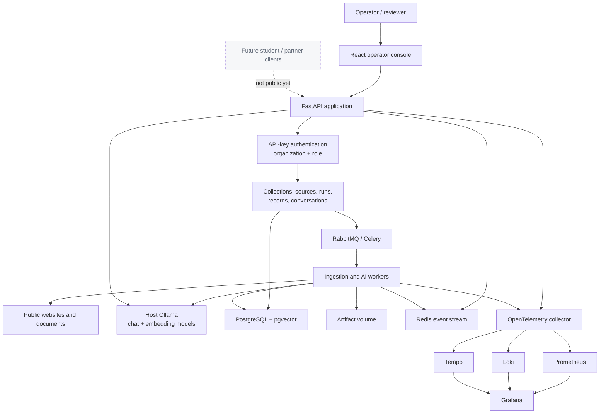
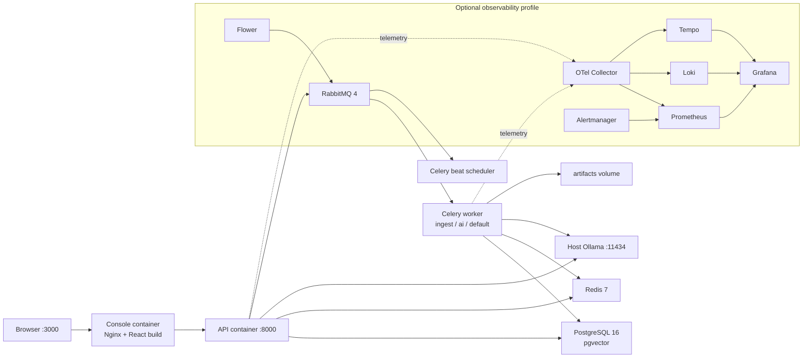
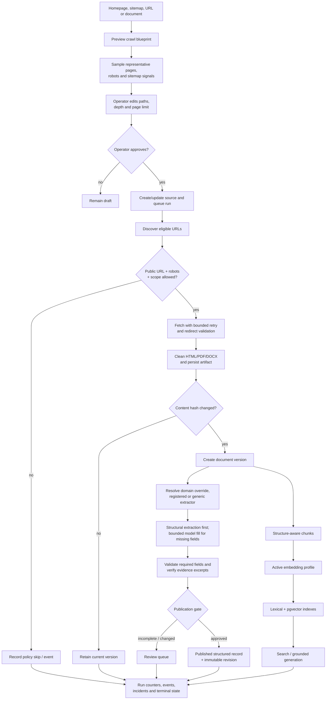
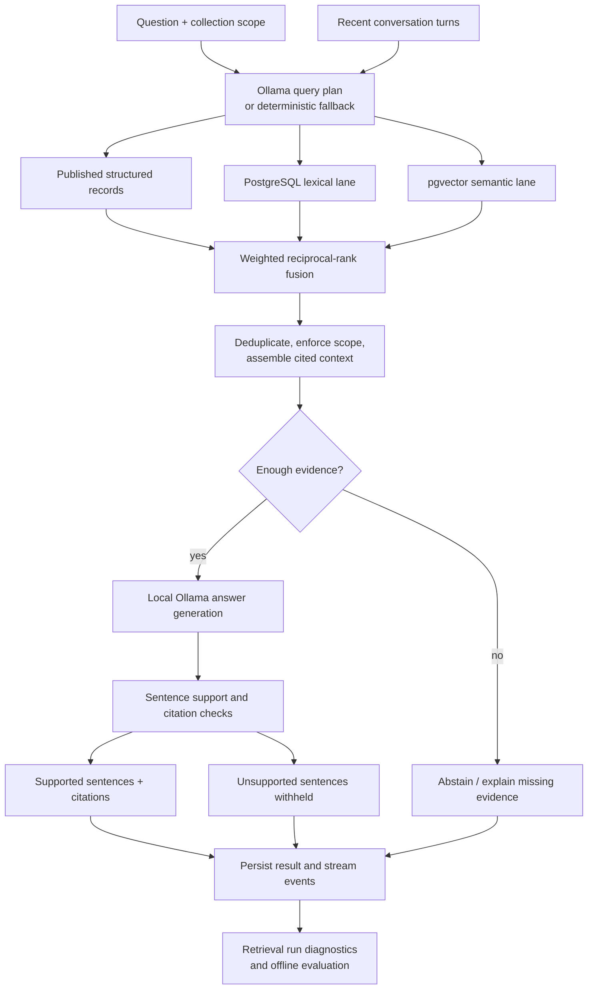
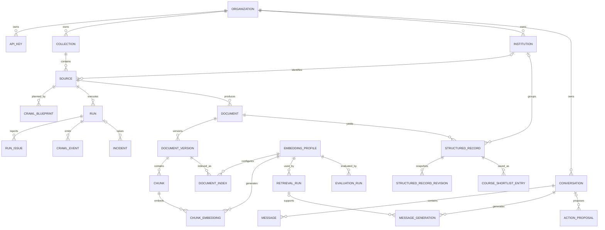

# Scrapal Master Product and Engineering Record

**Document status:** Living master record  
**Repository snapshot:** `v3`, commit `d578b10`  
**Last verified:** 4 September 2026  
**Primary purpose:** Describe what exists now, how it works, what it is expected to become, and the gates between those states.

This is the canonical high-level reference for Scrapal. It deliberately distinguishes working
implementation from partial work, expectations, and future product strategy. It supersedes any
older document wherever an older statement presents a planned capability as already shipped.

The standalone Mermaid sources are in [`docs/diagrams/`](diagrams/). Each diagram is also embedded
below so this document renders without additional tooling.

---

## 1. Executive position

Scrapal turns public websites and documents into structured, versioned, cited knowledge. Its first
vertical is international higher education, where it extracts course facts and retains the exact
evidence needed for a human or application to verify them.

The current product is best described as:

> **An evidence-first university data and retrieval platform in advanced internal alpha, with an
> operator console and the first student-facing course-discovery concepts implemented.**

It is not merely a scraper. It already contains ingestion orchestration, evidence-aware extraction,
review and publication controls, document/record versioning, hybrid RAG, evaluation, approval-gated
actions, tenant boundaries, and production-shaped observability.

It is also not yet a public student service, a general university catalogue, an agency SaaS product,
or a production deployment. The Course Gallery is currently an administrator surface, the identity
model is API-key based, real multi-site extraction accuracy has not been demonstrated at meaningful
scale, and the proposed public-beta privacy and product layers are not implemented.

### 1.1 Current phase assessment

| Product phase | Honest status | Meaning |
|---|---|---|
| Phase 0 — Trusted Knowledge Engine | **Advanced alpha / built and improving** | The full path exists, but broad live-site quality, recurring change monitoring, and operational hardening remain to be proven. |
| Phase 1 — Zero-cost Student Research Beta | **Partially started** | Discovery, evidence dossiers, filtering, shortlisting, and comparison exist inside the operator application. Public identity, local-first workspace, eligibility, budgeting, export, analytics, and safe launch operations do not. |
| Phase 2 — AI Student Counsellor | **Planned** | Grounded Q&A exists; goal-aware student orchestration and explainable personal recommendations do not. |
| Phase 3 onward | **Future** | Application agents, agencies, recruiter/interviewer, university partnerships, exchange, and global platform are strategy, not current functionality. |

### 1.2 What can be claimed today

- A working, test-backed evidence-first ingestion and RAG codebase exists.
- The platform can model multiple organizations, collections, institutions, sources, and roles.
- A crawl can be planned, bounded, approved, executed, inspected, cancelled, and selectively retried.
- Course facts can carry field-level excerpts, confidence, source URLs, and validation state.
- Records can move through review, publish, reject, and revision-history workflows.
- Published courses can be searched, filtered, shortlisted, opened as evidence dossiers, and compared.
- Retrieval can combine structured records, lexical search, and vector search, then generate a cited
  answer or abstain.
- The local deployment is architected around open-source infrastructure and host-run Ollama.

### 1.3 What must not be claimed yet

- “Works with any university website.”
- “Production ready,” “fully automated,” or “100% compliant.”
- A catalogue of a particular size without a verified production database report.
- Public student accounts, personalised eligibility, complete budgeting, or application management.
- Agency/university customers, live partner APIs, lead exchange, or enrolment attribution.
- Automated continuous monitoring unless recurring schedules are actually configured and observed.
- Current full-stack runtime health from this document alone; runtime evidence must be refreshed.

---

## 2. Product principles

These principles are architectural constraints, not marketing language.

1. **Evidence or silence.** A factual claim should be traceable to a source URL and excerpt. If the
   source does not support it, Scrapal should leave it unknown or abstain.
2. **Deterministic first, bounded AI second.** Parse structure and known signals before asking a
   model to fill gaps. Model output must be constrained and folded back through evidence checks.
3. **Human authority for consequential state.** Operators approve crawl scope and publication;
   agents propose actions but do not silently execute them.
4. **Versioned truth.** Changed documents and records become inspectable versions/revisions rather
   than silent overwrites.
5. **Tenant isolation.** Every API request resolves an organization and permission boundary before
   accessing data.
6. **Local-first AI.** The default model path is local Ollama. External model APIs are optional future
   fallbacks, not a required dependency.
7. **Observable failure.** Page failures, policy skips, worker state, incidents, traces, logs, and
   metrics should be visible rather than hidden behind one run status.
8. **Student agency.** Future personalisation and introductions must remain explainable,
   consent-gated, exportable, and revocable.
9. **Verify then publish.** Product counts, accuracy, freshness, costs, and outcomes are claims that
   require evidence.

---

## 3. System architecture

Standalone source: [`01-system-context.mmd`](diagrams/01-system-context.mmd)



### 3.1 Technology stack

| Layer | Current choice | Responsibility |
|---|---|---|
| Language/runtime | Python 3.12 | API, crawling, extraction, RAG, workers, evaluation |
| API | FastAPI + Pydantic | HTTP contracts, validation, dependency-based authorization, OpenAPI |
| Persistence | SQLAlchemy 2 + Alembic | Async domain persistence and schema evolution |
| Primary database | PostgreSQL 16 + pgvector | Tenant data, documents, structured records, events, vectors, lexical search |
| Test database | SQLite + aiosqlite | Fast isolated unit/service/API tests; vector values use JSON fallback |
| Queue | Celery + RabbitMQ | Ingestion, generation, and reindex workloads |
| Event/cache infrastructure | Redis | Crawl event streaming and operational state |
| Fetch/extraction | httpx, BeautifulSoup, trafilatura, pypdf, python-docx | Safe fetching, content cleanup, structural extraction |
| Local AI | Ollama | Query planning, bounded extraction assistance, embeddings, generation |
| Models | qwen2.5:7b-instruct, llama3.2:3b, nomic-embed-text | Default chat, fast, and 768-dimensional embedding profiles |
| Observability | OpenTelemetry, Prometheus, Loki, Tempo, Grafana, Alertmanager, Flower | Traces, metrics, logs, incidents, queue visibility |
| Console | React 19, TypeScript, Vite, TanStack Query/Table, Motion | Operator workflows and Course Gallery |
| Packaging | Docker Compose | Local integrated runtime and optional observability profile |

### 3.2 Repository map

| Location | Responsibility |
|---|---|
| [`src/scrapal/main.py`](../src/scrapal/main.py) | FastAPI application lifecycle, routers, CORS, health, metrics |
| [`src/scrapal/api.py`](../src/scrapal/api.py) | Core collections, sources, runs, documents, search, conversation and action APIs |
| [`src/scrapal/blueprints_api.py`](../src/scrapal/blueprints_api.py) | Crawl-plan preview, edit, approval, and launch |
| [`src/scrapal/course_intelligence_api.py`](../src/scrapal/course_intelligence_api.py) | Course review/publish/reject lifecycle and coverage reporting |
| [`src/scrapal/course_gallery_api.py`](../src/scrapal/course_gallery_api.py) | Published course catalogue, facets, natural-language filters, shortlist |
| [`src/scrapal/retrieval_api.py`](../src/scrapal/retrieval_api.py) | Retrieval Lab, embedding profiles, answer diagnostics, evaluations |
| [`src/scrapal/observability_api.py`](../src/scrapal/observability_api.py) | Operational overview, timelines, event stream, incidents, dependencies |
| [`src/scrapal/services/`](../src/scrapal/services/) | Ingestion, indexing, search, generation, evaluation, events and artifacts |
| [`src/scrapal/domain/university/`](../src/scrapal/domain/university/) | Course contracts, institution identity, site-specific and generic extraction |
| [`src/scrapal/connectors/`](../src/scrapal/connectors/) | Website and document connectors |
| [`src/scrapal/models.py`](../src/scrapal/models.py) | Database domain model |
| [`migrations/versions/`](../migrations/versions/) | Ten Alembic revisions from the initial schema through course shortlists |
| [`console/src/`](../console/src/) | Operator console and Course Gallery implementation |
| [`observability/`](../observability/) | Collector, dashboards, alerts, logs, traces and metrics configuration |
| [`tests/`](../tests/) | Backend extraction, lifecycle, retrieval, security and observability coverage |

---

## 4. Runtime and deployment architecture

Standalone source: [`02-runtime-deployment.mmd`](diagrams/02-runtime-deployment.mmd)



### 4.1 Default local topology

The base Compose profile starts PostgreSQL, RabbitMQ, Redis, the API, a Celery worker, Celery beat,
and the React/Nginx console. The observability profile adds the Collector, Prometheus, Loki, Tempo,
Grafana, Alertmanager, and Flower. Ollama intentionally remains on the host and is reached through
`host.docker.internal`.

| Service | Exposed endpoint | Notes |
|---|---|---|
| Console | `http://localhost:3000` | Nginx proxies `/api` to FastAPI |
| API/OpenAPI | `http://localhost:8000/docs` | `/health` and `/metrics` also exposed |
| RabbitMQ UI | `http://localhost:15672` | Local management interface |
| Grafana | `http://localhost:3001` | Optional observability profile |
| Prometheus | `http://localhost:9090` | Optional |
| Alertmanager | `http://localhost:9093` | Optional |
| Flower | `http://localhost:5555` | Optional |

### 4.2 Runtime expectations

- PostgreSQL, RabbitMQ, and Redis health checks gate API/worker startup.
- The console waits for a healthy API.
- Worker tasks acknowledge late, reject work after worker loss, and prefetch one job at a time.
- Async database connections are disposed between Celery task event loops.
- Application data remains durable when optional telemetry services are unavailable.
- Host Ollama should contain the three configured models before AI-dependent flows are exercised.

### 4.3 Deployment status and boundary

The Compose topology is a development and pilot architecture. It is not evidence of a production
deployment. No public DNS, Cloudflare Tunnel, TLS policy, production secret store, off-site backup,
restore drill, deployment pipeline, or uptime objective is represented by the current repository.

---

## 5. Implemented capability inventory

### 5.1 Identity, tenants, and roles

Implemented:

- `Organization` is the primary tenant boundary.
- API keys are stored as SHA-256 hashes and resolve an organization, role, scopes, and key ID.
- Roles exist for `super_admin`, `admin`, `editor`, and `viewer`.
- Core queries verify collection/source/run ownership through the principal's organization.
- Mutating source/run operations require editor-level roles; platform intelligence/observability and
  Course Gallery routes currently require `super_admin`.
- Startup bootstraps one local organization, development key, default embedding profile, and launch
  collection when the database is empty.

Current limitations:

- No student/customer sign-up, email verification, passwords, OAuth, passkeys, sessions, recovery,
  organization memberships, or granular end-user consent model.
- Scope strings are stored but role checks are the active authorization mechanism.
- The development API key is suitable only for local use and is compiled into the local console
  configuration.

### 5.2 Collections, institutions, and sources

Implemented:

- Collections isolate related knowledge within an organization.
- Institutions have stable organization-scoped domain and slug identities, country/city metadata,
  published branding fields, and per-institution settings.
- Sources support website, sitemap, URL-list/document and Greenwich/domain-specific modes.
- Website and document connectors are exposed as Python package entry points for extension.
- Sources and extracted university records can be attached to institutions.
- Institution branding can be derived conservatively from public pages.

Current limitations:

- Institution identity/deduplication is domain-led rather than a mature entity-resolution system.
- Only Greenwich has a registered site-specific course extractor; other domains use the generic
  extractor unless explicitly overridden.
- No authoritative first-party university feed or institution claim/verification workflow exists.

### 5.3 Crawl blueprints

Implemented:

- Preview accepts a start URL, research objective, domain pack, and required evidence fields.
- Planning validates public URLs, inspects robots/sitemap/link signals, classifies representative
  pages, samples content, and projects likely field coverage.
- Operators can edit literal include/exclude paths, maximum pages, and depth.
- A blueprint remains draft until explicitly approved.
- Launch creates or updates the source from the approved plan and queues an ingestion run.

Expected behaviour:

- Preview must not perform an unbounded crawl.
- User-controlled path rules remain inert strings and cannot execute code.
- The operator owns crawl scope and must review warnings before launch.

### 5.4 Crawl execution and resilience

Implemented:

- Safe public-URL validation to reduce server-side request-forgery risk.
- Redirects are revalidated hop by hop and capped.
- Bounded timeout/network retries and retry classification for HTTP 429/5xx.
- Robots checks, scope filters, page/depth caps, content-type handling, and cancellation.
- Incremental document versioning by content hash.
- Run counters for discovery, processed pages, created documents, issues, and policy skips.
- Retry of non-policy run issues through a linked retry run.
- Stale-run recovery and worker heartbeat tracking.
- Durable page/run events and incident creation at the worker boundary.

Current limitations:

- Broad live-site crawling behaviour has not been certified against a representative university set.
- The current scheduler container does not by itself define recurring crawl schedules.
- Per-domain politeness budgets, distributed leases, sophisticated canonicalisation, crawl traps,
  JavaScript rendering, and proxy strategy require further production work.

### 5.5 Content normalization and artifacts

Implemented:

- HTML fetching and cleaning.
- PDF and DOCX document parsing.
- Raw/normalized artifact paths and content metadata.
- Document identity by collection and canonical URL.
- Immutable document versions keyed by content hash.
- Current-version pointer on the document.

### 5.6 University course extraction

Implemented course contract:

- title, award, level, school;
- campus, study mode, duration, intake months and structured intakes;
- tuition fees by residency/currency/year/mode;
- academic and English requirements;
- application documents, routes, and deadlines;
- modules, accreditations, scholarships, overview, careers, and UCAS code;
- canonical source URL.

Extraction strategy:

1. Resolve explicit extractor override.
2. Resolve a registered domain-specific extractor.
3. Fall back to the generic university extractor.
4. Extract deterministic signals from JSON-LD, headings, definition lists, two-column tables, fee
   tables, and semantically named sections.
5. Use a bounded Ollama pass only for configured missing fields.
6. Require a quoted excerpt to accept a model-filled field.
7. Calculate coverage across the required publication contract.

Evidence stored per field includes source URL, field name, method, excerpt, optional section/selector,
and confidence. Legacy course records without field evidence are explicitly quarantined for recrawl.

Current validation boundary:

- Unit fixtures exercise Greenwich, Buckingham, and Westminster page structures.
- Greenwich has a specialized extractor.
- This does not yet establish reliable extraction across arbitrary university sites.

### 5.7 Review, publication, and revision history

Implemented:

- Record states: review, published, rejected.
- Validation metadata contains coverage, missing fields, and review reasons.
- Review updates data/evidence and stores reviewer and review timestamp.
- Publish checks evidence/validation requirements before making a course visible.
- Reject removes it from published views with a reason.
- Each material decision produces an immutable `StructuredRecordRevision` snapshot.
- Course Intelligence reports aggregate and per-institution coverage.

Expectation:

> A record being present is not equivalent to a field being evidenced, and neither is equivalent to
> publication approval.

### 5.8 Indexing and retrieval

Implemented:

- Structure-aware document chunking with headings, section paths, anchors, content hashes, and token
  counts.
- Version/profile-specific indexing lifecycle with waiting/running/ready/failed state.
- Embedding profiles are versioned and can be activated.
- PostgreSQL full-text indexes and pgvector HNSW index are created in production migrations.
- Search supports lexical, vector, hybrid, collection, and publication constraints.
- Query planning uses a structured Ollama response with a safe fallback when the model is unavailable.
- Follow-up turns can use a bounded recent transcript to resolve references.
- Published structured records participate alongside unstructured chunks.
- Candidate lists are fused with weighted reciprocal-rank fusion.
- Retrieval runs retain plans, candidates, exclusions, context, timing, trace, answer, citation results,
  model, and abstention reason.

### 5.9 Grounded generation

Implemented:

- Asynchronous or local-inline generation depending on configuration.
- Evidence context is passed with citation identities.
- Generated sentences are checked against source context.
- Unsupported statements are withheld rather than silently returned.
- Missing evidence can produce an explicit abstention.
- Generation lifecycle events can be streamed to the console.
- Request IDs prevent duplicate assistant messages for retried client submissions.

This is a grounded research assistant. It is not yet a personal counsellor that understands a student
profile and orchestrates eligibility, finance, scholarship, and planning tools.

### 5.10 Retrieval Lab and evaluation

Implemented:

- Run a query and inspect every retrieval lane and timing stage.
- Inspect generated answers, citations, exclusions, and abstention.
- List and activate embedding profiles.
- Reindex document versions for a selected profile.
- Run an asynchronous evaluation dataset and retain item-level results and aggregate metrics.
- A Greenwich RAG evaluation dataset is included.

Future expectation:

- Version datasets, define promotion thresholds, cover multiple institutions/languages, evaluate
  extraction and matching separately, and gate model/index changes on regression results.

### 5.11 Approval-gated agent actions

Implemented:

- An agent or user can create an action proposal with type, payload, rationale, risk, expiration, and
  conversation link.
- Authorized operators can edit, approve, or reject pending proposals.
- Expired/decided proposals cannot be treated as executable approvals.

Boundary:

- This is a safe action-control primitive, not the future application-agent suite.
- No university application is submitted, no student is contacted, and no lead is routed by the
  current implementation.

### 5.12 Observability

Implemented:

- OpenTelemetry instrumentation for FastAPI, HTTP, SQLAlchemy, Redis, and Celery.
- Trace/span IDs attached to crawl events and incidents.
- Prometheus metrics for runs, pages, bytes, output, RAG stages, candidates, and active work.
- Structured crawl events and Redis-backed live stream.
- Incident fingerprinting, occurrence counts, acknowledge, and resolve workflows.
- Worker and dependency health views.
- Grafana link generation scoped to run/trace context.
- Optional Grafana, Prometheus, Loki, Tempo, Alertmanager, and Flower stack.
- Secret-shaped log attributes are redacted.

### 5.13 Operator console

Implemented views:

1. Overview — operations brief, health, current work, recent runs.
2. Sources — configured inputs, source status, run launch and inspection.
3. Knowledge — documents and hybrid evidence search.
4. Course Intelligence — field coverage, review queue, evidence, publish/reject.
5. Course Gallery — public-shaped browsing over published records.
6. Retrieval Lab — query plans, candidates, context, answers and evaluations.
7. Observability — fleet/dependency health, events, incidents and traces.
8. Reviews — approval-gated action proposals.
9. Settings — local models and system state.
10. Ask Scrapal panel — cited grounded conversation.

The console includes collection scoping, responsive layouts, keyboard/dialog affordances, loading,
empty and failure states, theming, live refresh for operational views, and current run inspection.

### 5.14 Course Gallery

Implemented:

- Institution-led landing treatment using collected public branding.
- Natural-language query interpretation constrained to currently available facets.
- Visible, editable filters for institution, country, level, mode, campus, intake, duration, fee, and
  minimum evidence coverage.
- Keyword fallback when Ollama interpretation is unavailable.
- Sort and cursor-based pagination.
- Course cards and full dossiers showing what was published and what was not stated.
- Direct source links and per-field evidence receipts.
- Fees, scholarships, intakes, entry/English requirements, modules, careers, and revision timeline.
- Principal-scoped shortlist with notes.
- Side-by-side comparison of university, award, duration, mode, intake, tuition, and evidence coverage.

Current boundary:

- Routes are under `/v1/admin/course-gallery` and require `super_admin`.
- Shortlist state is stored in PostgreSQL against the API-key principal, not locally on a student's
  device.
- It is a convincing Phase 1 product slice inside an internal operator application, not the public
  Phase 1 product.

---

## 6. Core process diagrams

### 6.1 Ingestion, evidence, and publication

Standalone source: [`03-ingestion-lifecycle.mmd`](diagrams/03-ingestion-lifecycle.mmd)



### 6.2 Retrieval and generation

Standalone source: [`04-rag-generation.mmd`](diagrams/04-rag-generation.mmd)



---

## 7. Data architecture

Standalone source: [`05-data-domain.mmd`](diagrams/05-data-domain.mmd)



### 7.1 Data groups

| Group | Main tables | Purpose |
|---|---|---|
| Tenancy/security | organizations, api_keys | Organization resolution, roles and key state |
| Knowledge organization | collections, institutions, sources | Scope knowledge and associate it with institutions |
| Planning/execution | crawl_blueprints, runs, run_issues | Approved scope and durable execution state |
| Operational history | crawl_events, incidents | Page/run timelines and actionable failures |
| Source truth | documents, document_versions | Canonical pages and immutable content history |
| Retrieval index | chunks, embedding_profiles, document_indexes, chunk_embeddings | Versioned lexical/vector search material |
| Structured truth | structured_records, structured_record_revisions | Evidence-backed fields and decision history |
| Student-shaped alpha | course_shortlist_entries | Current principal-scoped saved courses |
| Conversation | conversations, messages, message_generations, generation_events | Grounded assistant state and progress |
| RAG quality | retrieval_runs, evaluation_runs | Reproducible diagnostics and regression metrics |
| Agent safety | action_proposals | Human approval boundary for proposed actions |

### 7.2 Data invariants

- Tenant-owned entities must be reachable only through their organization.
- A document version belongs to one document and content hash.
- An index is unique for a document version and embedding profile.
- A chunk embedding is unique for a chunk and embedding profile.
- A course record references its source document and, when resolved, its institution.
- A record revision number is unique per record.
- Only published records appear in the Course Gallery.
- A shortlist entry is unique per principal and record.
- A message request ID prevents duplicate roles for a conversation retry.
- Crawl/generation event sequence numbers are unique within their parent execution.

---

## 8. API surface

The following describes implemented families rather than duplicating the generated OpenAPI schema.

| Prefix/family | Implemented operations | Minimum current audience |
|---|---|---|
| `/health`, `/metrics` | Liveness and Prometheus scrape | System |
| `/v1/system` | Database/Redis/RabbitMQ/Ollama status | Authenticated viewer |
| `/v1/collections` | List/create collections | Viewer/editor |
| `/v1/sources` | List/create sources | Viewer/editor |
| `/v1/runs` | List/detail/events/create/cancel/retry/upload | Viewer/editor |
| `/v1/documents` | List versions and upload documents | Viewer/editor |
| `/v1/search` | Scoped structured/lexical/vector/hybrid search | Viewer |
| `/v1/records/{schema}` | Read structured records | Viewer |
| `/v1/conversations` | Create, message, generation status/events | Viewer |
| `/v1/action-proposals` | List/create/edit/approve/reject | Viewer/editor |
| `/v1/blueprints` | Preview/detail/edit/approve/run | Editor |
| `/v1/admin/course-intelligence` | Institutions, coverage, records, review/publish/reject/revisions | Super admin |
| `/v1/admin/course-gallery` | Interpret, institutions, courses, facets, dossiers, shortlist | Super admin |
| `/v1/admin/retrieval` | Retrieval runs, profiles, activation, evaluations | Super admin |
| `/v1/admin/observability` | Overview, runs, timeline, events, incidents, workers, dependencies | Super admin |

Before a public API exists, endpoint naming, pagination, quotas, error envelopes, version support,
privacy classification, and authorization scopes need an explicit partner contract.

---

## 9. Quality and verification status

### 9.1 Verified on 4 September 2026

| Check | Result |
|---|---|
| Backend pytest suite | **98 passed**, one third-party OpenTelemetry deprecation warning |
| Ruff | **Passed** |
| mypy across `src` | **Passed**, 41 source files |
| Frontend Vitest | **6 passed** across 2 files |
| ESLint | **Passed** |
| TypeScript + Vite production build | **Passed** |

The frontend build emitted a non-fatal large-chunk warning: the main minified JavaScript bundle was
approximately 547 kB (about 164 kB gzip). The installed npm version also warned that local Node
18.12.1 is below npm's supported Node 18 range; use Node 20+ for repeatable development/CI.

### 9.2 What these checks prove

- Current Python and TypeScript code compiles/type-checks.
- Tested API/service/domain behaviours pass in isolated environments.
- Core extraction, resilience, security, review, RAG lifecycle, search, gallery, institution, and
  observability contracts have automated regression coverage.
- The console can produce a deployable static build.

### 9.3 What these checks do not prove

- A complete current Docker run with PostgreSQL, RabbitMQ, Redis, Celery, Ollama, and the console.
- Correctness or performance against a large live university catalogue.
- Accuracy of model-assisted extraction on unseen layouts.
- Production backup/restore, failover, queue recovery, rolling deploys, or load capacity.
- Public security, penetration resistance, GDPR/PECR operation, accessibility certification, or
  browser/device compatibility.
- Student usefulness, retention, willingness to pay, or partner demand.

Docker Desktop was not running during this documentation update, so no current live database counts
or integrated runtime health claims are included.

### 9.4 Required evidence ledger

Every future release summary should record:

1. Git revision and environment.
2. Database migration head.
3. Container/service health.
4. Source and institution counts.
5. Published/review/rejected course counts.
6. Field coverage by institution.
7. Extraction precision/recall or reviewed accuracy sample.
8. Retrieval evaluation dataset/version and metrics.
9. Crawl success, policy-skip, retry, and freshness rates.
10. Security/privacy checks and known exceptions.
11. User research metrics when a public beta exists.

---

## 10. Present risks and gaps

### 10.1 Product/data risk

The core risk is not whether Scrapal can display courses; it is whether it can maintain a sufficiently
broad, fresh, complete, and auditable catalogue. The current system needs multi-institution evidence
before its generality becomes a defensible claim.

### 10.2 Extraction risk

- University sites vary in markup, terminology, locale, rendering, and anti-bot behaviour.
- A course page can contain multiple fee years, residencies, modes, campuses, and intakes.
- Model-generated fields can look plausible even when their excerpts do not prove the normalized
  value; evidence validation must remain strict.
- Site changes can reduce coverage silently unless baseline and change alerts are measured.

### 10.3 Security and privacy risk

- API keys are not suitable as public student identity.
- The current console assumes a trusted operator and super-admin access for intelligence surfaces.
- Public rate limiting, bot control, session security, account deletion/export, consent history,
  retention enforcement, and data-subject operations are absent.
- Public launch requires operating policies and a DPIA decision, not just code changes.
- Do not log prompts or personal profiles by default in the proposed privacy-minimal beta.

### 10.4 Operational risk

- The current single Compose stack has no demonstrated high availability.
- Ollama and the host are shared failure/capacity domains.
- Recurring scheduling and freshness SLAs are not implemented as a complete product feature.
- Backups, restore tests, disaster recovery, secret rotation, and alert routing need ownership.
- Large crawls require queue, storage, database, and per-domain concurrency/load tests.

### 10.5 UX risk

- The operator console and student product have different users and permission assumptions.
- Reusing the operator shell publicly would expose irrelevant complexity and unsafe controls.
- Course comparison should distinguish “not published” from “not applicable” and “not extracted.”
- Eligibility must never imply admission certainty.
- Cost estimates must expose date, currency, included/excluded categories, and assumptions.

---

## 11. Expectations and acceptance gates

### 11.1 Phase 0 exit: trusted knowledge pilot

Suggested minimum gate before describing the knowledge engine as broadly proven:

- 5–10 materially different universities, not only similar UK templates.
- A deliberately sampled set of at least 100 course pages reviewed by a human.
- Required-field precision and evidence-support metrics reported by field and institution.
- No published normalized value without a supporting excerpt or explicit authoritative feed.
- Failed/blocked/change states visible per page and per institution.
- Re-crawl produces deterministic unchanged results and auditable revisions when content changes.
- Retrieval regression suite covers all pilot institutions and important unanswerable questions.
- Integrated Postgres/pgvector, queue, Redis, worker, Ollama, and console run is reproducible.
- Backup and restore of database plus artifacts is demonstrated.

These are proposed gates, not results already achieved.

### 11.2 Phase 1 exit: zero-cost student market test

The first public beta should contain only the smallest experience needed to answer whether students
find evidence-backed research useful:

- Public student identity and safe account lifecycle.
- Lightweight, locally owned student profile.
- Course discovery, evidence dossier, shortlist, and comparison.
- Basic deterministic eligibility checks with per-requirement explanations.
- Scholarship discovery.
- Total-cost and funding-gap calculator with assumptions.
- Local research history/workspace using browser storage.
- JSON/Markdown/ZIP export and clear deletion/reset controls.
- Server stores only necessary account/limit state, aggregates, sanitized errors, and intentional
  feedback under defined retention.
- Rate limits, abuse protection, privacy notice, terms, contact/complaints route, and launch security
  review.
- Aggregate, privacy-preserving activation/retention/usefulness measurements.

Initial research target: approximately 100 genuinely relevant students. The goal is evidence of
activation, return, saving/export, citation use, failure points, and voluntarily submitted feedback—not
vanity traffic.

### 11.3 Production-readiness gate

Production should require explicit evidence for:

- supported environments and deployment/rollback;
- secrets, TLS, dependency updates, and vulnerability response;
- tenant isolation and authorization tests against PostgreSQL;
- quotas and backpressure at API, crawl, queue, database, model, and export layers;
- backups, point-in-time recovery, restore drills, retention, and deletion;
- SLOs, dashboards, routed alerts, incident process, and on-call ownership;
- legal/privacy basis, crawler policy, takedown/correction path, and data-processing records;
- load, endurance, failure-injection, and recovery tests;
- accessibility and supported-browser checks for public surfaces.

---

## 12. Future product architecture

### 12.1 Phase 1 — Student research beta

Build a separate public surface over the published knowledge APIs. Keep personal research, profile,
notes, comparisons, and plans local on the user's device wherever practical. Process a prompt
transiently when a server/model answer is required, without claiming that processing never occurs.

Proposed bounded feature set:

- cited university/course search;
- evidence-first course and scholarship discovery;
- shortlist and comparison;
- basic eligibility and budget tools;
- local workspace and export;
- privacy-preserving aggregate analytics and feedback.

Explicitly exclude agency CRM, commission, lead marketplace, application submission, advertising,
and payments from this experiment.

### 12.2 Phase 2 — Evidence-based AI counsellor

The counsellor should orchestrate deterministic tools over the same knowledge core:

- profile normalization;
- course matching;
- requirement-by-requirement eligibility;
- scholarship filtering;
- total-cost modelling;
- deadline and plan generation;
- source retrieval and change verification.

It should show `met`, `close`, `not met`, and `unknown`, name the exact gap, cite the rule, and avoid
predicting admission where the university has not made a deterministic commitment.

### 12.3 Phase 3 — Application assistance agents

Possible bounded agents include application planning, document checklists, CV/personal statement
assistance, scholarship applications, deadlines, offer comparison, and pre-departure planning.

Non-negotiable boundary:

> AI prepares, checks, organizes, and recommends. The student reviews and authorizes every
> consequential submission.

### 12.4 Phase 4 — Agency platform and data API

Potential commercial layer:

- agency/counsellor organization memberships and roles;
- caseload and pipeline;
- evidence-backed shortlist builder;
- document/deadline workspace;
- course, scholarship, and change-feed API;
- natural-language custom dataset requests exported to CSV/Excel/API/webhook;
- performance and source attribution;
- consent and audit controls.

Agency pricing or demand remains a hypothesis until validated with real customers.

### 12.5 Phase 5 — AI student recruiter

Add matched outreach only after identity, consent, verification, explainable ranking, abuse prevention,
and auditability are mature. Payment must never override match quality or student choice.

### 12.6 Phase 6 — AI interviewer

Two possible surfaces:

- private student interview practice with feedback and source-grounded preparation;
- consented agency/university pre-screening with disclosed criteria and human appeal.

High-stakes decisions must not be delegated to an opaque model score.

### 12.7 Phase 7 — University partnerships

After demand and data quality exist, universities can receive:

- an institution portal to verify/correct records;
- authoritative first-party feeds;
- aggregate demand and comparison analytics;
- consented enquiries and campaigns;
- agent/partner management;
- application/enrolment attribution where contracts and privacy permit.

### 12.8 Phase 8 — Lead and Match Exchange

The exchange connects students, counsellors, agencies, and universities only through explicit,
granular, revocable consent. Every introduction should be logged, rate-limited, explainable, and
visible to the student. The student is a participant, not inventory.

### 12.9 Phase 9 — Global education operating system

Long-term scope may include multi-country programme/scholarship/visa/cost knowledge, multilingual
experiences, regional deployments, first-party institutional feeds, partner APIs, and a connector or
country-pack ecosystem. This stage depends on completing the narrower data and usefulness gates; it
is not justification for building every surface now.

---

## 13. Roadmap diagram and dependency order

Standalone source: [`06-product-roadmap.mmd`](diagrams/06-product-roadmap.mmd)

```mermaid
flowchart LR
    P0["Phase 0<br/>Trusted knowledge engine<br/>CURRENT: advanced alpha"] --> Gate0{"Coverage and reliability<br/>proven across 5–10 sites"}
    Gate0 --> P1["Phase 1<br/>Zero-cost student research beta<br/>CURRENT: gallery slice only"]
    P1 --> Gate1{"Useful to 100 relevant students<br/>with safe public operations"}
    Gate1 --> P2["Phase 2<br/>Evidence-based AI counsellor"]
    P2 --> P3["Phase 3<br/>Application assistance agents"]
    P3 --> P4["Phase 4<br/>Agency platform + data API"]
    P4 --> P5["Phase 5<br/>AI student recruiter"]
    P5 --> P6["Phase 6<br/>AI interviewer"]
    P6 --> P7["Phase 7<br/>University partnerships"]
    P7 --> P8["Phase 8<br/>Consent-gated match exchange"]
    P8 --> P9["Phase 9<br/>Global education OS"]

    classDef current fill:#dff7e8,stroke:#238a57,color:#163d2b;
    classDef partial fill:#fff3ce,stroke:#bd7b00,color:#4b3500;
    classDef future fill:#f2f4f7,stroke:#8b95a5,color:#344054;
    class P0 current;
    class P1 partial;
    class P2,P3,P4,P5,P6,P7,P8,P9 future;
```



### 13.1 Recommended implementation sequence

1. **Measure the knowledge engine.** Select diverse institutions, crawl them, review sampled records,
   publish field-level accuracy/coverage, and fix systemic extraction failures.
2. **Automate freshness safely.** Add recurring schedules, change classification, review queues, and
   freshness/failed-page SLAs.
3. **Separate public and operator APIs.** Design stable read-only public course contracts, quotas,
   caches, redaction, and end-user authorization without exposing admin routes.
4. **Build privacy-minimal identity and local workspace.** Introduce account/limit state and local
   profile/history/export while minimizing server persistence.
5. **Ship the bounded student experiment.** Reuse Gallery concepts in a dedicated public experience;
   add basic eligibility, scholarship, cost, feedback, and aggregate analytics.
6. **Measure usefulness.** Decide whether to deepen the counsellor or adjust the research product
   based on activation/return/save/export/citation/feedback evidence.
7. **Build professional tools only after demand signal.** Begin with a narrow agency data API or
   custom dataset workflow before a full CRM.
8. **Add university and exchange surfaces after consent, verification, and outcomes exist.**

---

## 14. Recommended next milestone

The immediate milestone is not “build all Phase 1 features.” It is:

> **Complete a controlled multi-university data-quality pilot, then expose the already convincing
> Course Gallery concepts through a separate, privacy-minimal student beta.**

Suggested work package:

1. Choose 5–10 universities with deliberately different content structures.
2. Create approved blueprints and run complete bounded crawls.
3. Review a stratified sample of course records and compute per-field evidence-supported accuracy.
4. Record crawl completeness, failure classes, model usage, throughput, and recrawl stability.
5. Fix cross-site extraction patterns before adding more site-specific extractors.
6. Add recurring crawl/change schedules and freshness reporting.
7. Define a read-only public course API separate from admin routes.
8. Move student shortlist/research state to a local workspace and add export/reset.
9. Implement minimal public identity, limits, privacy controls, and feedback.
10. Run a small student test only when data quality and safe public operations meet their gates.

---

## 15. Operating and development guide

### 15.1 Local integrated startup

```bash
cp .env.example .env
docker compose up --build
```

Ollama runs on the host and should have:

```text
qwen2.5:7b-instruct
llama3.2:3b
nomic-embed-text:latest
```

Optional full observability:

```bash
docker compose --profile observability up --build
```

### 15.2 Backend development

```bash
python3.12 -m venv .venv
source .venv/bin/activate
pip install -e '.[dev]'
uvicorn scrapal.main:app --reload
```

### 15.3 Verification commands

```bash
.venv/bin/pytest -q
.venv/bin/ruff check .
.venv/bin/mypy src
cd console
npm test -- --run
npm run lint
npm run build
```

### 15.4 Database evolution

- Local application startup can create an initial schema for development.
- Production-shaped environments should use `alembic upgrade head`.
- Current migration head is `0010_course_gallery_shortlist`.
- Schema changes should add a migration, model changes, tests, and rollback consideration.

---

## 16. Documentation rules

Update this master document whenever any of the following changes:

- product phase or acceptance gate;
- runtime topology or external dependency;
- tenant/security/privacy boundary;
- data entity or migration head;
- extraction contract or evidence rule;
- public/admin API split;
- verified coverage, evaluation, performance, or user metric;
- feature moves between future, partial, and implemented.

When editing an embedded diagram, update its matching `.mmd` source in the same change. Use these
labels consistently:

- **Implemented:** present in current code and supported by repository evidence.
- **Partially implemented:** meaningful code exists but the promised end-to-end user outcome does not.
- **Expected:** required behaviour or acceptance criterion, not yet proof.
- **Future:** strategy that has no current shipping claim.
- **Verified:** executed against the stated revision and environment, with the result recorded.

---

## 17. Final north star

Scrapal's defensible asset is not a large page count or a generic chatbot. It is the chain of custody
between a public source and a decision:

```text
source
  -> bounded collection
  -> normalized version
  -> extracted field
  -> evidence receipt
  -> validation
  -> human publication
  -> retrieval
  -> cited explanation
  -> consented action
```

The long-term product can serve students, counsellors, agencies, universities, and partners only if
that chain remains visible and trustworthy. Features should therefore be sequenced by evidence:
first prove the data, then prove student usefulness, then build professional workflows, and only then
build a marketplace or exchange.

> **Cited by default. Human-controlled where it matters. Verified before it is claimed.**
